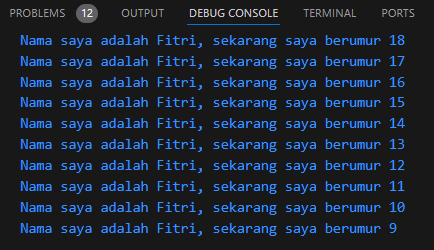

# Tugas Praktikum : Pengantar Bahasa Pemrograman Dart - Bagian 1
---

### SOAL 1
Modifikasilah kode pada baris 3 di VS Code atau Editor Code favorit Anda berikut ini agar mendapatkan keluaran (output) sesuai yang diminta!

``` Dart
void main() {
  for (int i = 19; i > 9; i--) {
    print('Nama saya adalah Fitri, sekarang saya berumur ${i - 1}');
  }
} 
```

Output :



### SOAL 2
Mengapa sangat penting untuk memahami bahasa pemrograman Dart sebelum kita menggunakan framework Flutter ? Jelaskan!
>Jawab : Karena semua pengembangan framework Flutter melibatkan pengetahuan/fitur mendalam dengan bahasa Dart. Selain itu akan memudahkan kita untuk menjadi lebih produktif dengan Flutter.
### SOAL 3
Rangkumlah materi dari codelab ini menjadi poin-poin penting yang dapat Anda gunakan untuk membantu proses pengembangan aplikasi mobile menggunakan framework Flutter.
>Jawab : 
>##### Evolusi Dart
>- Diluncurkan: 2011
>- Tujuan: Memiliki tujuan umum dengan terus meningkatkan fitur-fiturnya, membuatnya lebih kekinian dan fleksibel
>- Ciri Khas:
>   - Alat modern dan stabil untuk proyek besar
>   - Type annotations opsional
>   - Fitur OOP (Object-Oriented Programming)
>##### Cara Dart Bekerja
>- Eksekusi Kode:
>   - Dart Virtual Machines (VMs)
>   - JavaScript Compilations
>
>- Mode Eksekusi Kode:
>   - Kompilasi Just-In-Time (JIT) : tempat kode sumber dikompilasi sesuai kebutuhan
>   - Kompilasi Ahead-Of-Time (AOT) : proses dimana Dart VM dan kode yang dikompilasi sebelumnya dijalankan
>##### Fitur Penting 
>- Productive Tooling: menyediakan tools produktif seperti analisator kode
>- Garbage Collection: mengelola memori dengan membebaskan objek yang tidak lagi digunakan
>- Type Annotations: untuk keamanan dan konsistensi data, membantu pengembang mengontrol tipe data dalam aplikasi
>- Statically Typed: untuk menemukan bug selama kompilasi
>- Portability: dapat digunakan di berbagai platform, dari web, native ARM dan x86.
>##### Object Orientation
>- Dart adalah bahasa object-oriented (OO). 
>- Objek menyimpan data (fields) dan kode (methods).
>- Dart mendukung encapsulation, inheritance, composition, abstraction, dan polymorphism
>##### Dart Operators
>
>1. Arithmetic Operators
>  - (+) untuk penjumlahan.
>  - (-) untuk pengurangan.
>  - (*) untuk perkalian.
>  - (/) untuk pembagian (menghasilkan double).
>  - (~/) untuk pembagian bilangan bulat.
>  - (%) untuk modulus.
>  - (-expression) untuk negasi.
>
>
>2. Increment and Decrement Operator
> - (++var atau var++) untuk menambah var sebesar 1.
> - (--var atau var--) untuk mengurangi var sebesar 1.
>3. Equality and Relational Operators
> - (==) memeriksa kesetaraan.
> - (!=) memeriksa ketidaksamaan.
> - (>) memeriksa apakah lebih besar.
> - (<) memeriksa apakah lebih kecil.
> - (>=) memeriksa apakah lebih besar atau sama dengan.
> - (<=) memeriksa apakah lebih kecil atau sama dengan.
>4. Logical Operators
> - (!expression) untuk negasi (membalikkan nilai boolean).
> - (||) untuk OR.
> - (&&) untuk AND