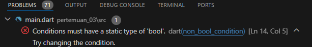

**Nama : Rizky Fitri Andini
Kelas : TI - 3F / 24
NIM : 2241720170**

 
# **Tugas Praktikum : Pengantar Bahasa Pemrograman Dart - Bagian 2**
---

## SOAL 1
Silakan selesaikan Praktikum 1 sampai 3, lalu dokumentasikan berupa screenshot hasil pekerjaan beserta penjelasannya!
### Praktikum 1: Menerapkan Control Flows ("if/else")
Selesaikan langkah-langkah praktikum berikut ini menggunakan DartPad di browser Anda.

#### Langkah 1:
Ketik atau salin kode program berikut ke dalam fungsi main().
```Dart
void main(){
String test = "test2";
if (test == "test1") {
   print("Test1");
} else If (test == "test2") {
   print("Test2");
} Else {
   print("Something else");
}

if (test == "test2") print("Test2 again");
}
```
#### Langkah 2:
Silakan coba eksekusi (Run) kode pada langkah 1 tersebut. Apa yang terjadi? Jelaskan!


>Jawab : Kode ada kesalahan dalam sintaksis penulisan. Penulisan if else menggunakan huruf kapital pada beberapa bagian, yang akan menyebabkan error saat dieksekusi. Berikut adalah kode yang sudah diperbaiki:
``` Dart
void main(){
String test = "test2";
    if (test == "test1") {
       print("Test1");
    } else if (test == "test2") {
       print("Test2");
    } else {
       print("Something else");
    }

    if (test == "test2") print("Test2 again");
}
```

Output :

#### Langkah 3:
Tambahkan kode program berikut, lalu coba eksekusi (Run) kode Anda.
``` Dart
void main(){
String test = "true";
    if (test) {
      print("Kebenaran");
    }
}
```
Output:

>Jawab : Kode tersebut menyebabkan error karena tipe data String tidak dapat langsung digunakan sebagai ekspresi boolean. Berikut adalah kode yang sudah diperbaiki:
```Dart
void main(){
String test = "true";
  if (test == "true") {
    print("Kebenaran");
  } 
}
```
Output:

### Praktikum 2: Menerapkan Perulangan "while" dan "do-while"
Selesaikan langkah-langkah praktikum berikut ini menggunakan DartPad di browser Anda.

#### Langkah 1:
Ketik atau salin kode program berikut ke dalam fungsi main().
```Dart
void main(){
  while (counter < 33) {
    print(counter);
    counter++;
  }
}
```
#### Langkah 2:
Silakan coba eksekusi (Run) kode pada langkah 1 tersebut. Apa yang terjadi? Jelaskan! Lalu perbaiki jika terjadi error.

>Jawab : Terjadi error karena variable counter belum dideklarasikan dan diinisialisasikan. Berikut adalah kode yang sudah diperbaiki:
```Dart
void main(){
int counter = 0;
    while (counter < 33) {
      print(counter);
      counter++;
    }
}
```
Output:

#### Langkah 3:
Tambahkan kode program berikut, lalu coba eksekusi (Run) kode Anda.
```Dart
void(){
do {
  print(counter);
  counter++;
} while (counter < 77);
}
```
Apa yang terjadi ? Jika terjadi error, silakan perbaiki namun tetap menggunakan do-while.


>Jawab : Tidak terjadi error, hasil program akan melanjutkan kode sebelumnya yang awalnya berhenti di 32 dan dilanjut dari angka 33 sampai 76.
### Praktikum 3: Menerapkan Perulangan "for" dan "break-continue"
Selesaikan langkah-langkah praktikum berikut ini menggunakan DartPad di browser Anda.

#### Langkah 1:
Ketik atau salin kode program berikut ke dalam fungsi main().
```Dart
void main(){
    for (Index = 10; index < 27; index) {
      print(Index);
    }
}
```
#### Langkah 2:
Silakan coba eksekusi (Run) kode pada langkah 1 tersebut. Apa yang terjadi? Jelaskan! Lalu perbaiki jika terjadi error.

>Jawab : Error dikarenakan variabel index belum dideklarasikan dan di inisialisasi. 
Berikut kode yang telah diperbaiki :
```Dart
void main() {
  for (int index = 10; index < 27; index++) {
    print(index);
  }
}
```
Output:


#### Langkah 3:
Tambahkan kode program berikut di dalam for-loop, lalu coba eksekusi (Run) kode Anda.
```Dart
void main(){
    If (Index == 21) break;
    Else If (index > 1 || index < 7) continue;
    print(index);
}
```
Apa yang terjadi ? Jika terjadi error, silakan perbaiki namun tetap menggunakan for dan break-continue.

Kode yang telah diperbaiki:
```Dart
void main() {
  for (int index = 10; index < 27; index++) {
    print(index);
    if (index == 21) break;
    else if (index > 1 || index < 7) continue;
  }
}
```
Output:

## SOAL 2
Buatlah sebuah program yang dapat menampilkan bilangan prima dari angka 0 sampai 201 menggunakan Dart. Ketika bilangan prima ditemukan, maka tampilkan nama lengkap dan NIM Anda.
```Dart
 void main() {
  // Nama lengkap dan NIM
  const namaLengkap = 'Rizky Fitri Andini';
  const nim = '2241720170';
  
  bool isPrime(int number) {
    if (number <= 1) return false;
    if (number <= 3) return true;
    if (number % 2 == 0 || number % 3 == 0) return false;
    
    for (int i = 5; i * i <= number; i += 6) {
      if (number % i == 0 || number % (i + 2) == 0) return false;
    }
    
    return true;
  }

  for (int i = 0; i <= 201; i++) {
    if (isPrime(i)) {
      print('Bilangan Prima: $i');
      print('Nama Lengkap: $namaLengkap');
      print('NIM: $nim');
      print('---');
    }
  }
}
```
Output:

