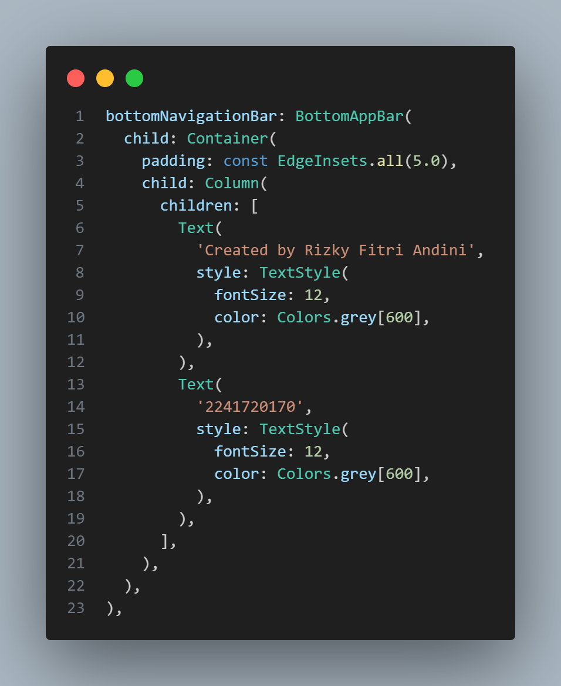

<table>
    <thead>
        <th style="text-align: center;" colspan="2">Pertemuan 6</th>
    </thead>
    <tbody>
        <tr>
            <td>Nama</td>
            <td>Rizky Fitri Andini</td>
        </tr>
        <tr>
            <td>Nim</td>
            <td>2241720170</td>
        </tr>
    </tbody>
</table>

# Pertemuan 06 - Layout dan Navigasi
Pada codelab ini, Anda akan mempelajari konsep dan praktik untuk dasar-dasar framework Flutter dengan menerapkan layout dan navigasi.

**Tujuan Praktikum**
Setelah menyelesaikan codelab ini Anda akan mampu untuk:
- menerapkan jenis-jenis layout
- menerapkan navigasi
- menerapkan routing

## Praktikum 1: Membangun Layout di Flutter
Selesaikan langkah-langkah praktikum berikut ini menggunakan editor Visual Studio Code (VS Code) atau Android Studio atau code editor lain kesukaan Anda.
### Langkah 1: Buat Project Baru
Buatlah sebuah project flutter baru dengan nama **layout_flutter**. Atau sesuaikan style laporan praktikum yang Anda buat.

### Langkah 2: Buka file lib/main.dart
Buka file `main.dart` lalu ganti dengan kode berikut. Isi nama dan NIM Anda di `text title`.

Output:

### Langkah 3: Identifikasi layout diagram
- Pertama, identifikasi elemen yang lebih besar. Dalam contoh ini, empat elemen disusun menjadi sebuah kolom: sebuah gambar, dua baris, dan satu blok teks.
- Selanjutnya, buat diagram setiap baris. Baris pertama, disebut bagian Judul, memiliki 3 anak: kolom teks, ikon bintang, dan angka. Anak pertamanya, kolom, berisi 2 baris teks. Kolom pertama itu memakan banyak ruang, sehingga harus dibungkus dengan widget yang Diperluas.
- Setelah tata letak telah dibuat diagramnya, cara termudah adalah dengan menerapkan pendekatan bottom-up. Untuk meminimalkan kebingungan visual dari kode tata letak yang banyak bertumpuk, tempatkan beberapa implementasi dalam variabel dan fungsi.

### Langkah 4: Implementasi title row
Pertama, Anda akan membuat kolom bagian kiri pada judul. Tambahkan kode berikut di bagian atas metode build() di dalam kelas `MyApp`:

Output:

## Praktikum 2: Implementasi button row
Selesaikan langkah-langkah praktikum berikut ini dengan melanjutkan dari praktikum sebelumnya.

### Langkah 1: Buat method Column _buildButtonColumn
Bagian tombol berisi 3 kolom yang menggunakan tata letak yang sama—sebuah ikon di atas baris teks. Kolom pada baris ini diberi jarak yang sama, dan teks serta ikon diberi warna primer.

Karena kode untuk membangun setiap kolom hampir sama, buatlah metode pembantu pribadi bernama `buildButtonColumn()`, yang mempunyai parameter warna, `Icon` dan `Text`, sehingga dapat mengembalikan kolom dengan widgetnya sesuai dengan warna tertentu.

### Langkah 2: Buat widget buttonSection
Buat Fungsi untuk menambahkan ikon langsung ke kolom. Teks berada di dalam Container dengan margin hanya di bagian atas, yang memisahkan teks dari ikon.

Bangun baris yang berisi kolom-kolom ini dengan memanggil fungsi dan set warna, Icon, dan teks khusus melalui parameter ke kolom tersebut. Sejajarkan kolom di sepanjang sumbu utama menggunakan MainAxisAlignment.spaceEvenly untuk mengatur ruang kosong secara merata sebelum, di antara, dan setelah setiap kolom. Tambahkan kode berikut tepat di bawah deklarasi titleSection di dalam metode build():

### Langkah 3: Tambah button section ke body
Tambahkan variabel buttonSection ke dalam body seperti berikut:

Output:

## Praktikum 3: Implementasi text section
Selesaikan langkah-langkah praktikum berikut ini dengan melanjutkan dari praktikum sebelumnya.

### Langkah 1: Buat widget textSection
Tentukan bagian teks sebagai variabel. Masukkan teks ke dalam `Container` dan tambahkan padding di sepanjang setiap tepinya. Tambahkan kode berikut tepat di bawah deklarasi `buttonSection`:

### Langkah 2: Tambahkan variabel text section ke body
Tambahkan widget variabel textSection ke dalam body seperti berikut:

Output:

## Praktikum 4: Implementasi image section
Selesaikan langkah-langkah praktikum berikut ini dengan melanjutkan dari praktikum sebelumnya.

### Langkah 1: Siapkan aset gambar
Anda dapat mencari gambar di internet yang ingin ditampilkan. Buatlah folder images di root project layout_flutter. Masukkan file gambar tersebut ke folder images, lalu set nama file tersebut ke file pubspec.yaml seperti berikut:

Contoh nama file gambar di atas adalah lake.jpg

### Langkah 2: Tambahkan gambar ke body
Tambahkan aset gambar ke dalam `body` seperti berikut:

`BoxFit.cover` memberi tahu kerangka kerja bahwa gambar harus sekecil mungkin tetapi menutupi seluruh kotak rendernya.

### Langkah 3: Terakhir, ubah menjadi ListView
Pada langkah terakhir ini, atur semua elemen dalam `ListView`, bukan Column, karena `ListView` mendukung scroll yang dinamis saat aplikasi dijalankan pada perangkat yang resolusinya lebih kecil.

Output:

## Praktikum 5: Membangun Navigasi di Flutter
Pada praktikum 5 ini anda akan belajar mengenai pembangunan aplikasi bergerak multi halaman. Aplikasi yang dikembangkan berupa kasus daftar barang belanja. Pada aplikasi ini anda akan belajar untuk berpindah halaman dan mengirimkan data ke halaman lainnya. Gambaran mockup hasil akhir aplikasi dapat anda lihat pada gambar di atas (mockup dibuat sederhana, sehingga Anda mempunyai banyak ruang untuk berkreasi). Desain aplikasi menampilkan sebuah `ListView` widget yang datanya bersumber dari `List`. Ketika item ditekan, data akan dikirimkan ke halaman berikutnya.
### Langkah 1: Siapkan project baru
Sebelum melanjutkan praktikum, buatlah sebuah project baru Flutter dengan nama belanja dan susunan folder seperti pada gambar berikut. Penyusunan ini dimaksudkan untuk mengorganisasi kode dan widget yang lebih mudah.

### Langkah 2: Mendefinisikan Route
Buatlah dua buah file dart dengan nama `home_page.dart` dan `item_page.dart` pada folder **pages**. Untuk masing-masing file, deklarasikan `class HomePage` pada file `home_page.dart` dan `ItemPage` pada `item_page.dart`. Turunkan class dari `StatelessWidget`. Gambaran potongan kode dapat anda lihat sebagai berikut.

### Langkah 3: Lengkapi Kode di main.dart
Setelah kedua halaman telah dibuat dan didefinisikan, bukalah file main.dart. Pada langkah ini anda akan mendefinisikan Route untuk kedua halaman tersebut. Definisi penamaan route harus bersifat unique. Halaman HomePage didefinisikan sebagai /. Dan halaman ItemPage didefinisikan sebagai /item. Untuk mendefinisikan halaman awal, anda dapat menggunakan named argument initialRoute. Gambaran tahapan ini, dapat anda lihat pada potongan kode berikut.

Output:

### Langkah 4: Membuat data model
Sebelum melakukan perpindahan halaman dari `HomePage` ke `ItemPage`, dibutuhkan proses pemodelan data. Pada desain mockup, dibutuhkan dua informasi yaitu nama dan harga. Untuk menangani hal ini, buatlah sebuah file dengan nama `item.dart` dan letakkan pada folder **models**. Pada file ini didefinisikan pemodelan data yang dibutuhkan. Ilustrasi kode yang dibutuhkan, dapat anda lihat pada potongan kode berikut.

### Langkah 5: Lengkapi kode di class HomePage
Pada halaman `HomePage` terdapat `ListView` widget. Sumber data `ListView` diambil dari model List dari object Item. Gambaran kode yang dibutuhkan untuk melakukan definisi model dapat anda lihat sebagai berikut.
Langkah 6: Membuat ListView dan itemBuilder
Untuk menampilkan ListView pada praktikum ini digunakan itemBuilder. Data diambil dari definisi model yang telah dibuat sebelumnya. Untuk menunjukkan batas data satu dan berikutnya digunakan widget Card. Kode yang telah umum pada bagian ini tidak ditampilkan. Gambaran kode yang dibutuhkan dapat anda lihat sebagai berikut.

Output:

### Langkah 6: Menambahkan aksi pada ListView
Item pada ListView saat ini ketika ditekan masih belum memberikan aksi tertentu. Untuk menambahkan aksi pada ListView dapat digunakan widget InkWell atau GestureDetector. Perbedaan utamanya InkWell merupakan material widget yang memberikan efek ketika ditekan. Sedangkan GestureDetector bersifat umum dan bisa juga digunakan untuk gesture lain selain sentuhan. Pada praktikum ini akan digunakan widget InkWell.
Untuk menambahkan sentuhan, letakkan cursor pada widget pembuka Card. Kemudian gunakan shortcut quick fix dari VSCode (Ctrl + . pada Windows atau Cmd + . pada MacOS). Sorot menu wrap with widget... Ubah nilai widget menjadi InkWell serta tambahkan named argument onTap yang berisi fungsi untuk berpindah ke halaman ItemPage. Ilustrasi potongan kode dapat anda lihat pada potongan berikut.

Output:

## Tugas 01
1. Selesaikan Praktikum 1 sampai 4, lalu dokumentasikan dan push ke repository Anda berupa screenshot setiap hasil pekerjaan beserta penjelasannya di file LaporanPraktikum.md!
src praktikum 1-4 : <a href="D:\SEMESTER 5\24-2241720170-MOBILE-2024\pertemuan_06\week6\layout_flutter">layout_flutter</a>.
2. Silakan implementasikan di project baru "basic_layout_flutter" dengan mengakses sumber ini: https://docs.flutter.dev/codelabs/layout-basics
src tugas 02 :  <a href="D:\SEMESTER 5\24-2241720170-MOBILE-2024\pertemuan_06\week6\basic_layout_flutter">basic_layout_flutter</a>.

## Tugas 02
1. Untuk melakukan pengiriman data ke halaman berikutnya, cukup menambahkan informasi arguments pada penggunaan Navigator. Perbarui kode pada bagian Navigator menjadi seperti berikut.
`Navigator.pushNamed(context, '/item', arguments: item);`

2. Pembacaan nilai yang dikirimkan pada halaman sebelumnya dapat dilakukan menggunakan ModalRoute. Tambahkan kode berikut pada blok fungsi build dalam halaman ItemPage. Setelah nilai didapatkan, anda dapat menggunakannya seperti penggunaan variabel pada umumnya. (https://docs.flutter.dev/cookbook/navigation/navigate-with-arguments)
`final itemArgs = ModalRoute.of(context)!.settings.arguments as Item;`

3. Pada hasil akhir dari aplikasi belanja yang telah anda selesaikan, tambahkan atribut foto produk, stok, dan rating. Ubahlah tampilan menjadi GridView seperti di aplikasi marketplace pada umumnya.
- home_page

- item_page

- item

Output:

4. Silakan implementasikan Hero widget pada aplikasi belanja Anda dengan mempelajari dari sumber ini: https://docs.flutter.dev/cookbook/navigation/hero-animations
- home_page

- item_page

5. Sesuaikan dan modifikasi tampilan sehingga menjadi aplikasi yang menarik. Selain itu, pecah widget menjadi kode yang lebih kecil. Tambahkan Nama dan NIM di footer aplikasi belanja Anda.

Output:

6. Selesaikan Praktikum 5: Navigasi dan Rute tersebut. Cobalah modifikasi menggunakan plugin go_router, lalu dokumentasikan dan push ke repository Anda berupa screenshot setiap hasil pekerjaan beserta penjelasannya di file README.md. Kumpulkan link commit repository GitHub Anda kepada dosen yang telah disepakati!
