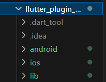
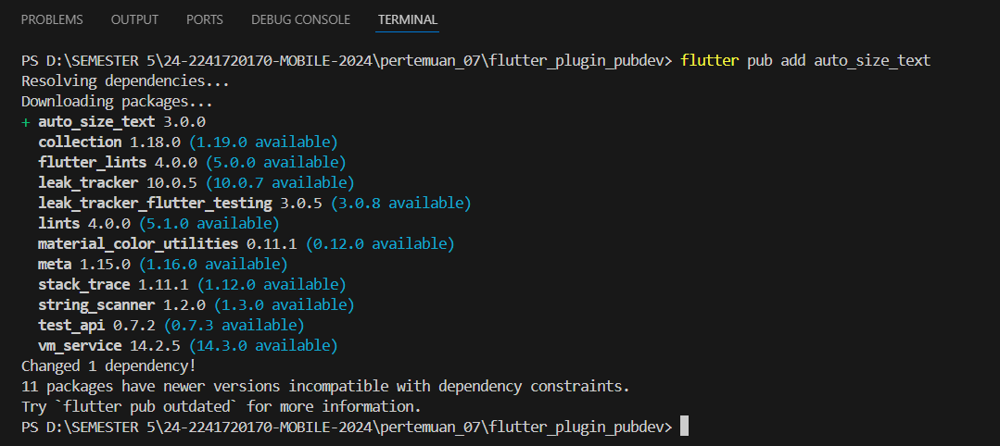
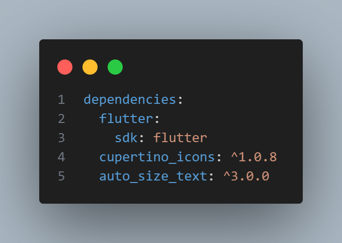
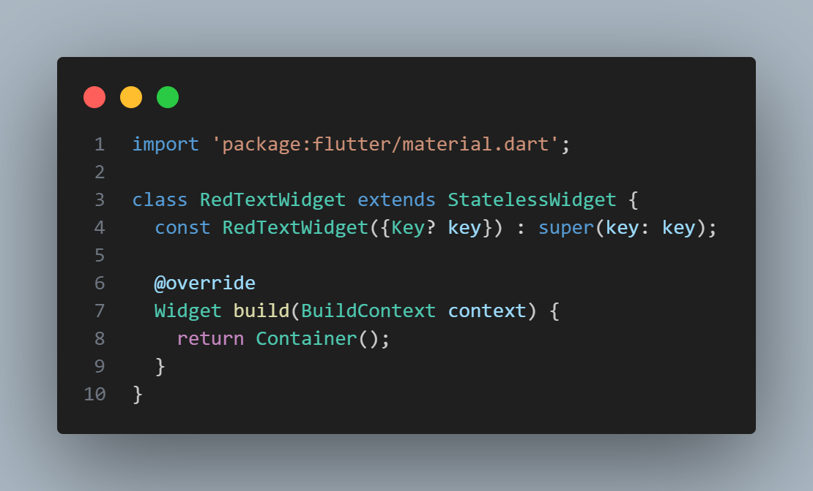
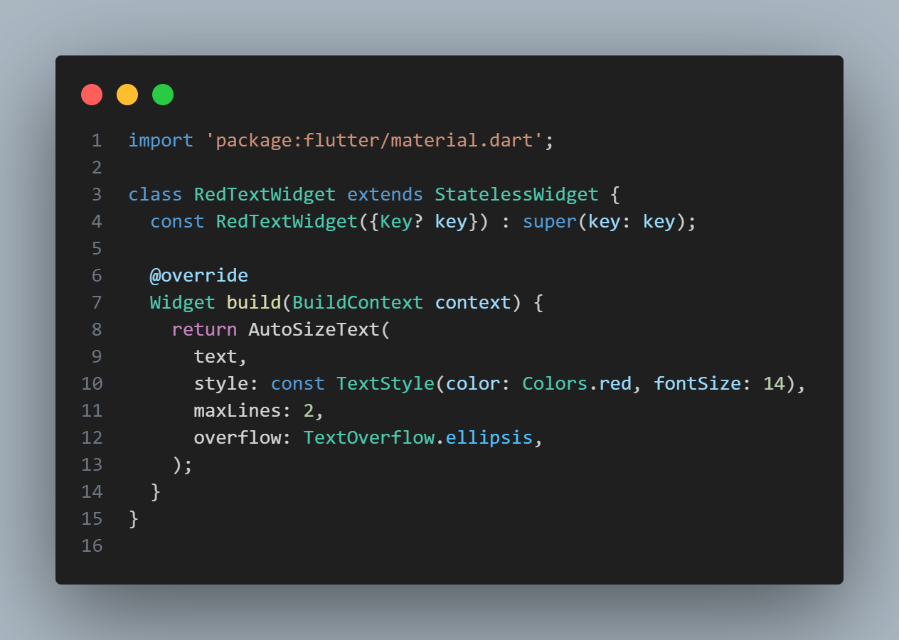
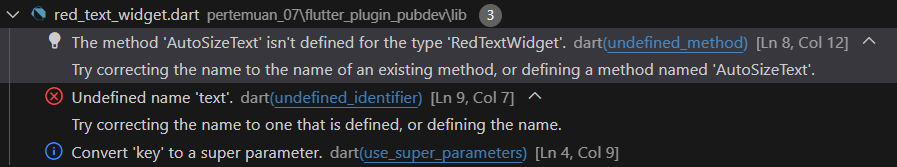
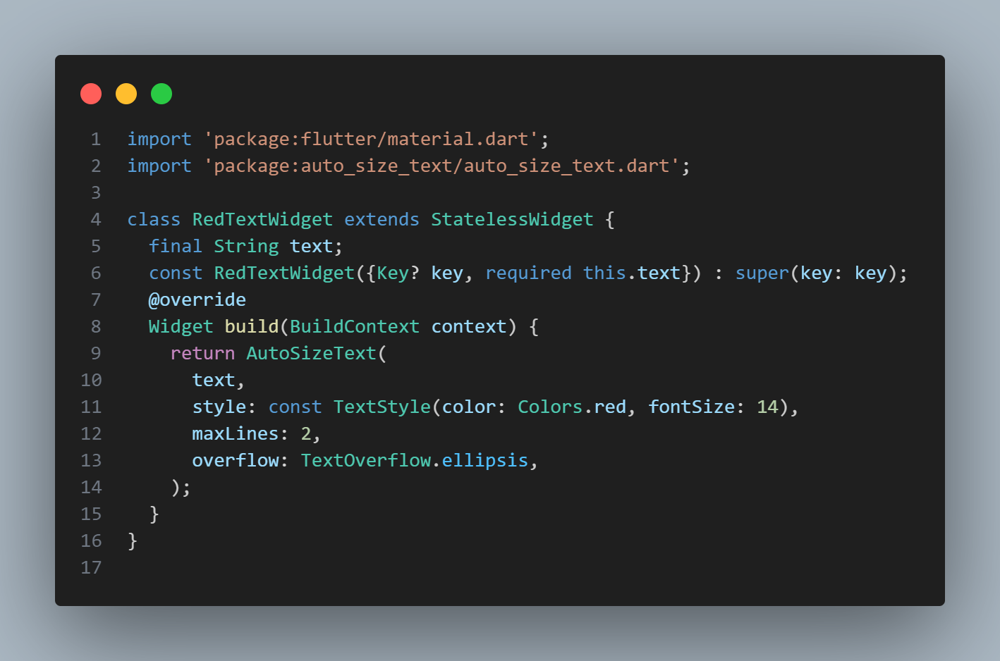
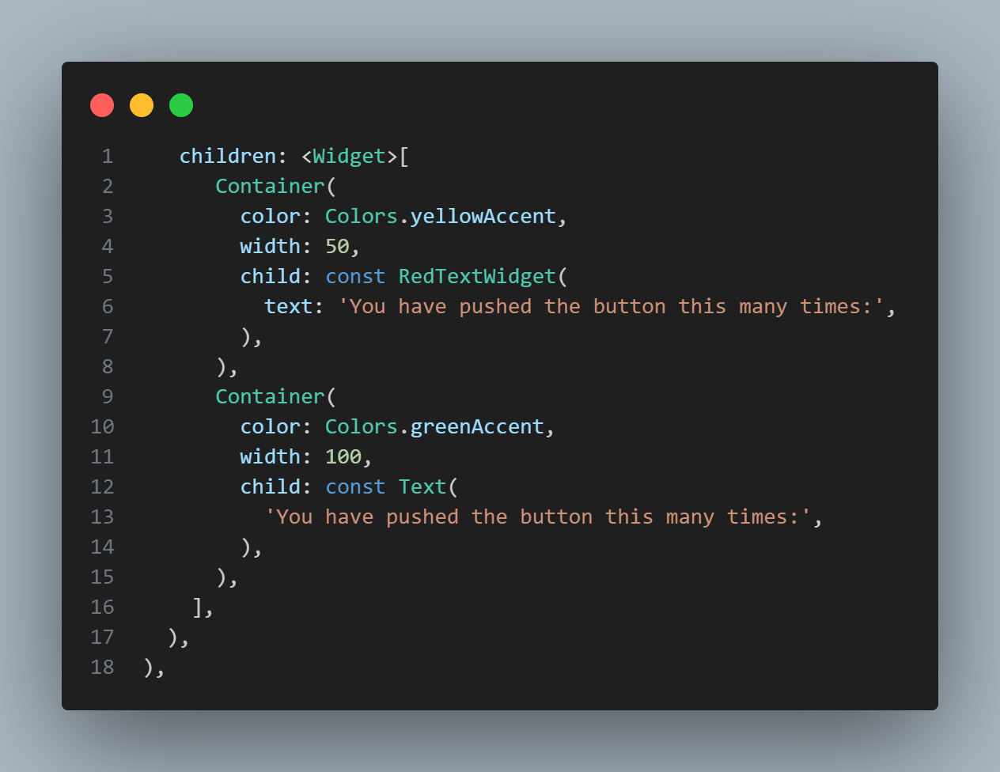
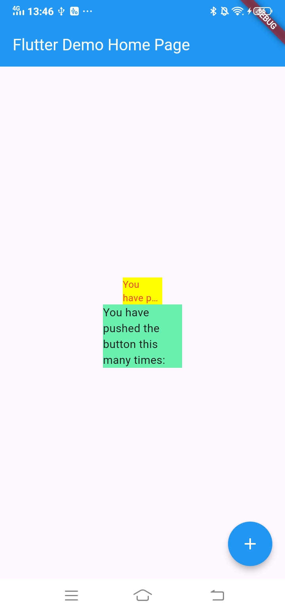

<table>
    <thead>
        <th style="text-align: center;" colspan="2">Pertemuan 7</th>
    </thead>
    <tbody>
        <tr>
            <td>Nama</td>
            <td>Rizky Fitri Andini</td>
        </tr>
        <tr>
            <td>Nim</td>
            <td>2241720170</td>
        </tr>
    </tbody>
</table>

# Pertemuan 07 | Manajemen Plugin
Pada codelab ini, Anda akan mempelajari tentang plugin Flutter beserta contoh penggunaannya. Cara kerja, manfaat, dan cara memasang plugin ke dalam project flutter.
Tujuan Praktikum. Setelah menyelesaikan codelab ini Anda akan mampu untuk:
- menjelaskan manfaat plugin
- memasang plugin ke dalam project flutter
- memanfaatkan plugin dalam aplikasi
## Praktikum Menerapkan Plugin di Project Flutter
Selesaikan langkah-langkah praktikum berikut ini menggunakan editor Visual Studio Code (VS Code) atau Android Studio atau code editor lain kesukaan Anda.
### Langkah 1: Buat Project Baru
Buatlah sebuah project flutter baru dengan nama flutter_plugin_pubdev. Lalu jadikan repository di GitHub Anda dengan nama flutter_plugin_pubdev.

### Langkah 2: Menambahkan Plugin
Tambahkan plugin auto_size_text menggunakan perintah berikut di terminal

Jika berhasil, maka akan tampil nama plugin beserta versinya di file pubspec.yaml pada bagian dependencies.

### Langkah 3: Buat file red_text_widget.dart
Buat file baru bernama red_text_widget.dart di dalam folder lib lalu isi kode seperti berikut.

### Langkah 4: Tambah Widget AutoSizeText
Masih di file red_text_widget.dart, untuk menggunakan plugin auto_size_text, ubahlah kode return Container() menjadi seperti berikut.

Setelah Anda menambahkan kode di atas, Anda akan mendapatkan info error. Mengapa demikian? Jelaskan dalam laporan praktikum Anda!

>Jawab: Error terjadi karena Undefined Method AutoSizeText.  Jika menggunakan widget AutoSizeText dari package `auto_size_text`, perlu mengimpor package tersebut di file Dart. Tanpa pengimporan, Dart tidak akan mengenali widget tersebut.

### Langkah 5: Buat Variabel text dan parameter di constructor
Tambahkan variabel text dan parameter di constructor seperti berikut.

### Langkah 6: Tambahkan widget di main.dart
Buka file main.dart lalu tambahkan di dalam children: pada class _MyHomePageState

Output:

## Tugas Praktikum
1. Selesaikan Praktikum tersebut, lalu dokumentasikan dan push ke repository Anda berupa screenshot hasil pekerjaan beserta penjelasannya di file README.md!
2. Jelaskan maksud dari langkah 2 pada praktikum tersebut!
>Jawab: Kode tersebut untuk menambahkan plugin auto_size_text ke dalam proyek Flutter yang telah dibuat. Secara spesifik, langkah ini bertujuan untuk memungkinkan aplikasi Flutter menyesuaikan ukuran teks secara otomatis agar sesuai dengan ruang yang tersedia, menggunakan plugin auto_size_text.
3. Jelaskan maksud dari langkah 5 pada praktikum tersebut!
>Jawab: Variabel final String text mendefinisikan bahwa widget RedTextWidget akan menerima sebuah nilai teks (String). Dengan menambahkan variabel text dan parameter di constructor, widget RedTextWidget sekarang bisa menampilkan teks yang dapat disesuaikan berdasarkan kebutuhan. Hal ini membuat widget lebih fleksibel dan reusable dalam berbagai konteks tanpa perlu mendefinisikan ulang widget untuk setiap teks yang berbeda.
4. Pada langkah 6 terdapat dua widget yang ditambahkan, jelaskan fungsi dan perbedaannya!
>Jawab: RedTextWidget memberikan kontrol lebih pada gaya teks yang konsisten (dalam hal ini warna merah), sementara Text adalah widget standar yang menampilkan teks tanpa pengaturan gaya kecuali ditentukan secara manual. Kedua Container berfungsi sebagai pembungkus untuk teks, tetapi memiliki perbedaan dalam ukuran dan warna latar belakang.
5. Jelaskan maksud dari tiap parameter yang ada di dalam plugin auto_size_text berdasarkan tautan pada dokumentasi ini !
>Jawab: 
>- text 
Ini adalah teks yang akan ditampilkan oleh widget AutoSizeText. Di dalam kode, teks ini diteruskan dari konstruktor widget RedTextWidget. Teks yang diteruskan wajib diisi dan akan otomatis menyesuaikan ukurannya sesuai ruang yang tersedia.
>- style
Mengatur gaya dari teks yang ditampilkan, seperti warna, ukuran font, ketebalan, dll. Pada kode ini, gaya teks diatur dengan warna merah (Colors.red) dan ukuran font 14. Jika tidak ditentukan, gaya default yang digunakan.
>- maxLines 
Menentukan jumlah maksimal baris yang bisa digunakan untuk menampilkan teks. Di dalam kode, maxLines: 2 berarti teks akan ditampilkan dalam maksimal dua baris. Jika teks terlalu panjang, maka sisanya akan dipotong sesuai pengaturan overflow.
>- overflow 
Menentukan bagaimana teks yang melebihi ruang yang tersedia harus ditampilkan. Pada kode ini, TextOverflow.ellipsis berarti teks yang melebihi batas akan dipotong dan digantikan dengan tanda elipsis (...). Nilai lainnya yang bisa digunakan adalah TextOverflow.clip (memotong teks tanpa tanda elipsis) atau TextOverflow.fade (membuat teks yang meluap memudar).
6. Kumpulkan laporan praktikum Anda berupa link repository GitHub kepada dosen!