<table>
    <thead>
        <th style="text-align: center;" colspan="2">Pertemuan 9</th>
    </thead>
    <tbody>
        <tr>
            <td>Nama</td>
            <td>Rizky Fitri Andini</td>
        </tr>
        <tr>
            <td>Nim</td>
            <td>2241720170</td>
        </tr>
    </tbody>
</table>

# **Pertemuan 09 | Kamera**

## Praktikum 1 : Mengambil Foto dengan Kamera di Flutter
Selesaikan langkah-langkah praktikum berikut ini menggunakan editor Visual Studio Code (VS Code) atau Android Studio atau code editor lain kesukaan Anda.
### Langkah 1
Buat sebuah project flutter baru dengan nama `kamera_flutter`
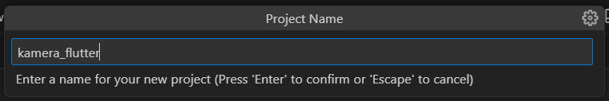

### Langkah 2
Jalankan perintah `flutter pub add`

### Langkah 3
Kode ini letakkan dalam `void main()` pada `lib/main`.dart dan ubah `void main()` menjadi async function 
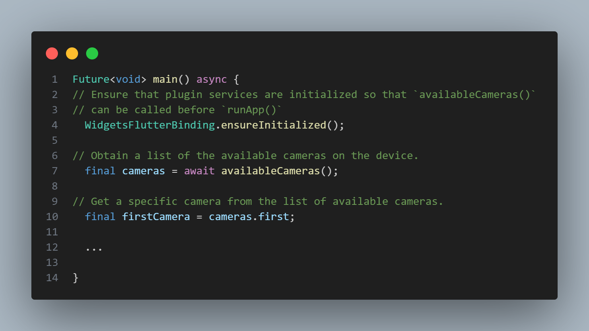

### Langkah 4
Membuat dan menginisialisasi `CameraController`
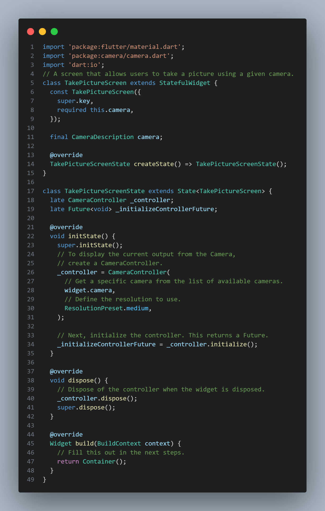

### Langkah 5
Gunakan widget `CameraPreview` dari package camera untuk menampilkan preview foto. Perlu tipe objek void berupa `FutureBuilder` untuk menangani proses async.
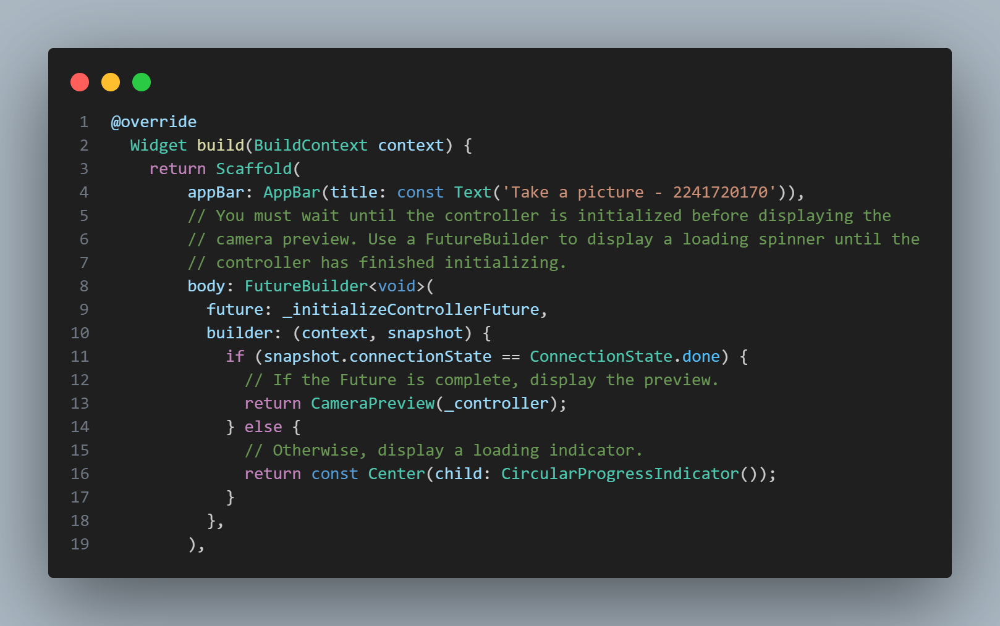

### Langkah 6
Kode berikut letakkan dalam `Widget build` setelah field body pada `lib/widget/takepicture_screen.dart`
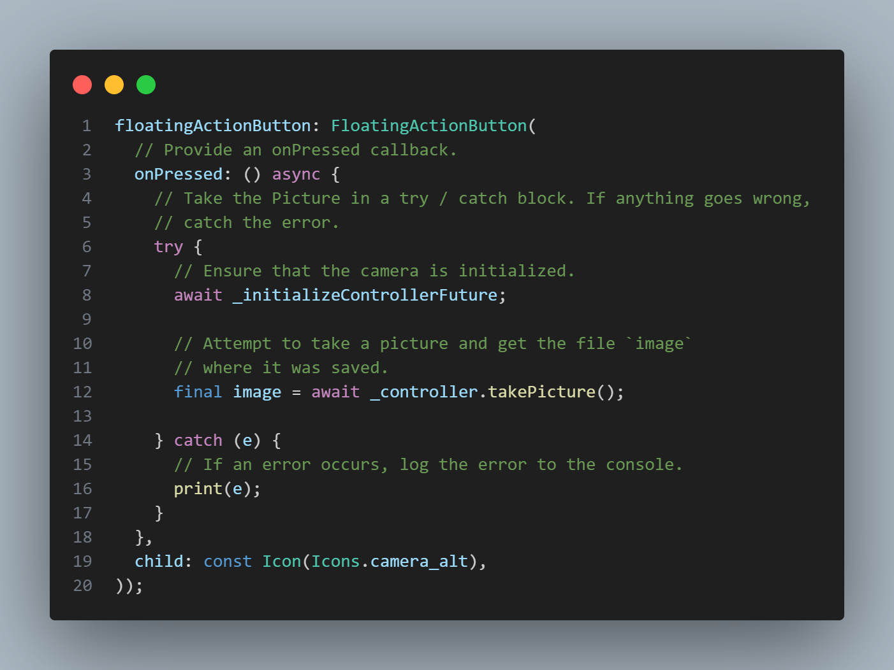

### Langkah 7
Buat file baru `displaypicture_screen.dart `pada `lib/widget`
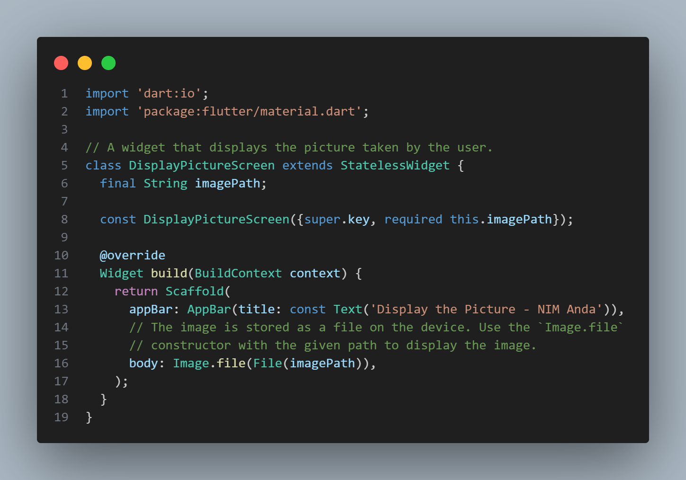

### Langkah 8
Edit pada file ini bagian `runApp` pada `lib/main.dart`
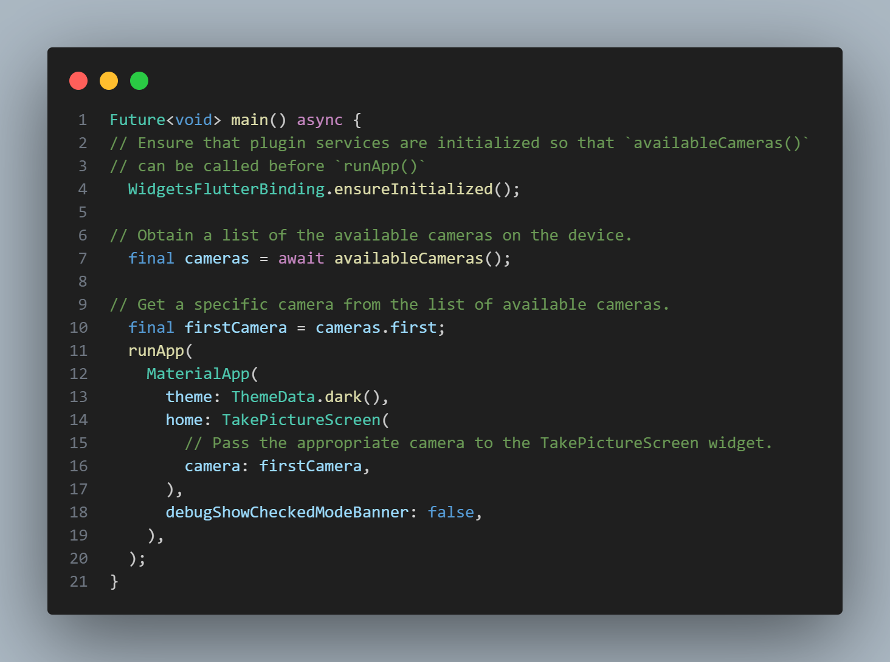

### Langkah 9
Tambahkan kode seperti berikut pada bagian try / catch agar dapat menampilkan hasil foto pada `DisplayPictureScreen`.

Hasil:
Take a picture
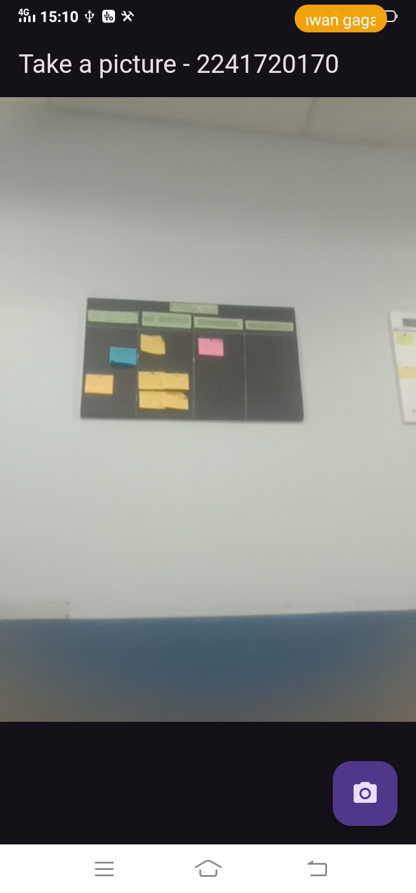

Display the picture
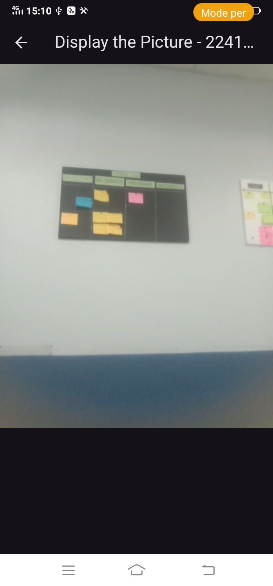

## Praktikum 2 : Membuat photo filter carousel
Semua orang tahu bahwa foto akan terlihat lebih bagus dengan filter. Pada codelab ini, Anda akan membuat rangkaian pilihan filter yang dapat digeser sesuai pilihan warna.

Berikut ini menunjukkan aplikasi yang akan Anda buat:

### Langkah 1
Buat project flutter baru dengan nama `photo_filter_carousel`
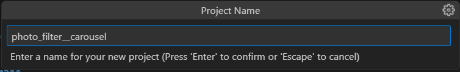

### Langkah 2
Buatlah folder widget dan file baru dengan nama `filter_selector.dart`

### Langkah 3
Buatlah folder widget dan file baru dengan nama `filter_carousel.dart`
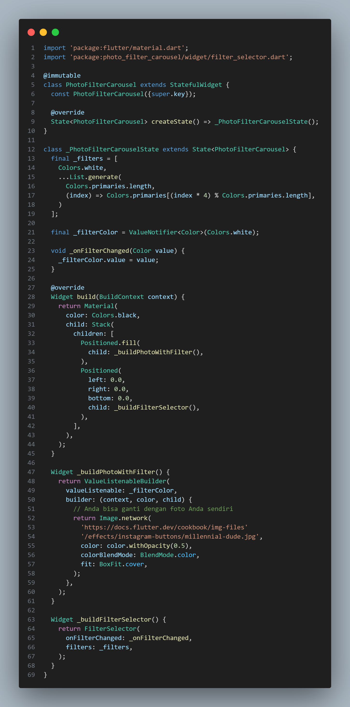

### Langkah 4
Buatlah folder widget dan file baru dengan nama `filter_item.dart`
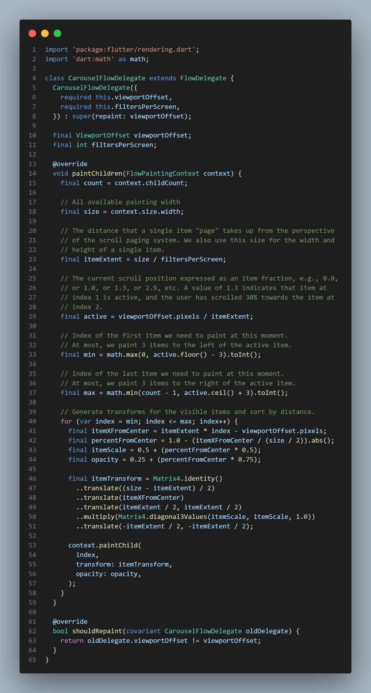

### Langkah 5
Buatlah folder widget dan file baru dengan nama `carousel_flowdelegate.dart`
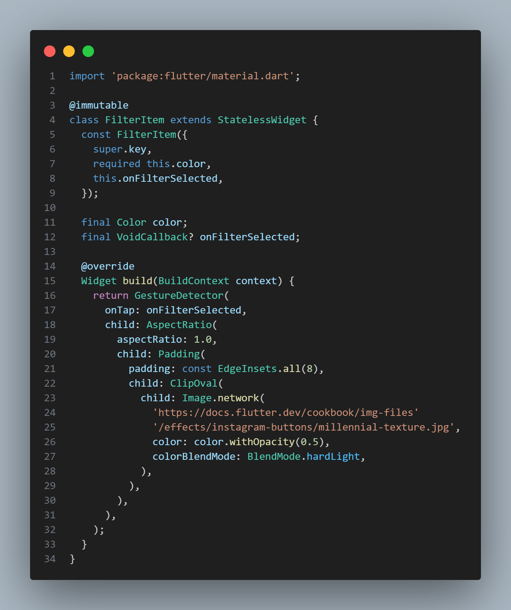

### Langkah 6
Tambah kode pada `void main()`
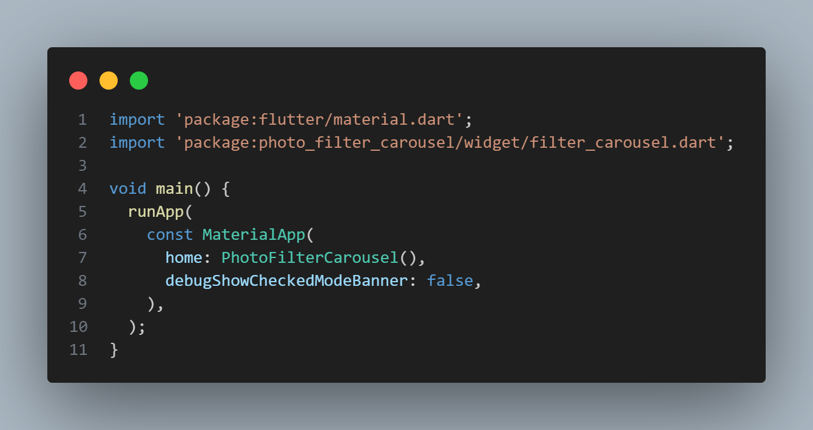

Hasil:

## TUGAS
1. Selesaikan Praktikum 1 dan 2, lalu dokumentasikan dan push ke repository Anda berupa screenshot setiap hasil pekerjaan beserta penjelasannya di file README.md! Jika terdapat error atau kode yang tidak dapat berjalan, silakan Anda perbaiki sesuai tujuan aplikasi dibuat!
2. Gabungkan hasil praktikum 1 dengan hasil praktikum 2 sehingga setelah melakukan pengambilan foto, dapat dibuat filter carouselnya!
Copy paste file filter pada praktikum 2 ke praktikum 1
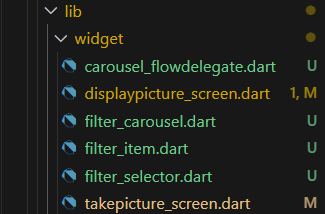
Ubah pada `file_carousel.dart`
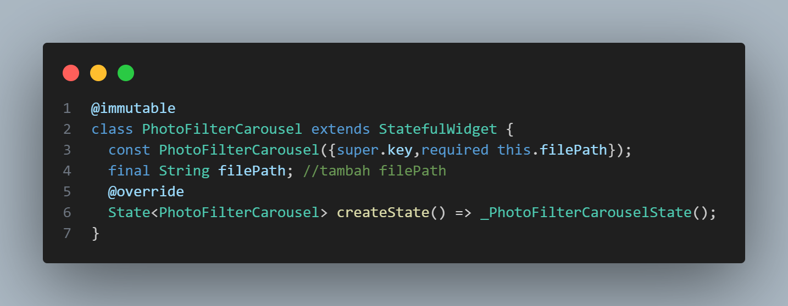
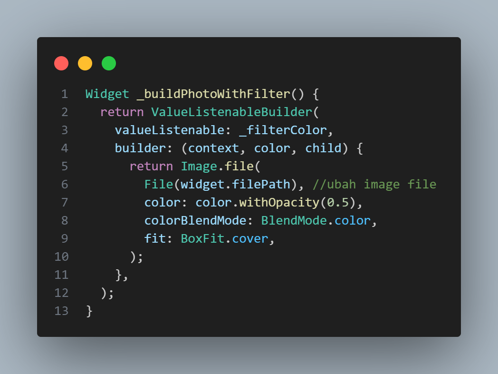
Ubah pada `displaypicture_screen.dart`
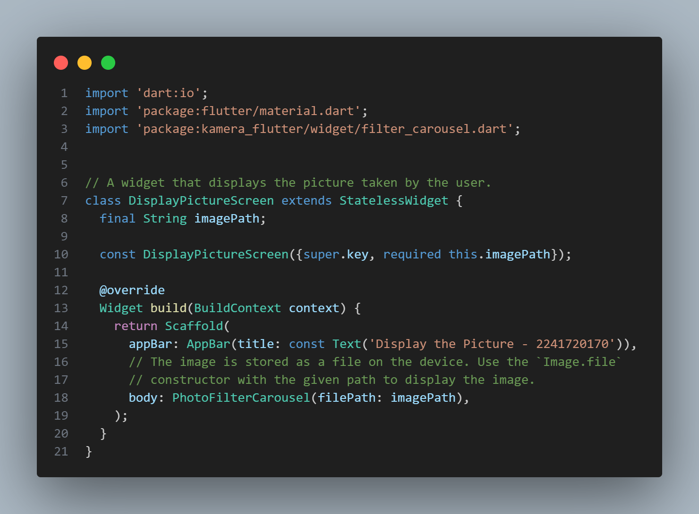
Hasil:

3. Jelaskan maksud void async pada praktikum 1?
Maksud void sync pada praktikum 1 untuk mengambil foto menggunakan kamera perangkat:
- `WidgetsFlutterBinding.ensureInitialized();` memastikan plugin kamera siap digunakan sebelum aplikasi berjalan.
- `availableCameras()` mengembalikan daftar kamera yang tersedia pada perangkat, seperti kamera depan dan belakang
- `cameras.first` memilih kamera pertama dari daftar
- `runApp()` menjalankan aplikasi dengan TakePictureScreen, yang menerima kamera pertama sebagai input untuk menangkap gambar

4. Jelaskan fungsi dari anotasi @immutable dan @override ?
- `@immutable` digunakan untuk menandai bahwa semua properti dalam suatu kelas harus bersifat immutable (tidak bisa diubah setelah inisialisasi). Anotasi ini sering digunakan pada kelas widget yang stateless
- `@override` digunakan untuk menunjukkan bahwa sebuah metode (fungsi) di dalam suatu kelas mengganti atau meng-override metode dari kelas induknya
5. Kumpulkan link commit repository GitHub Anda kepada dosen yang telah disepakati!