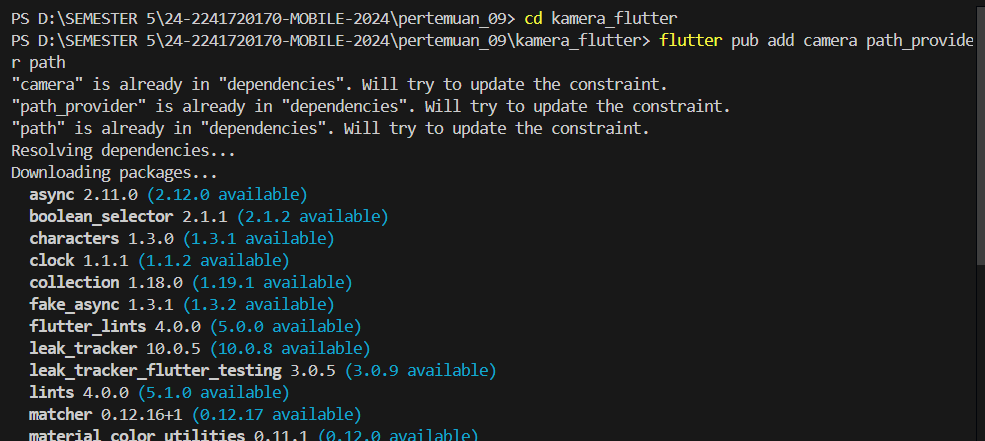
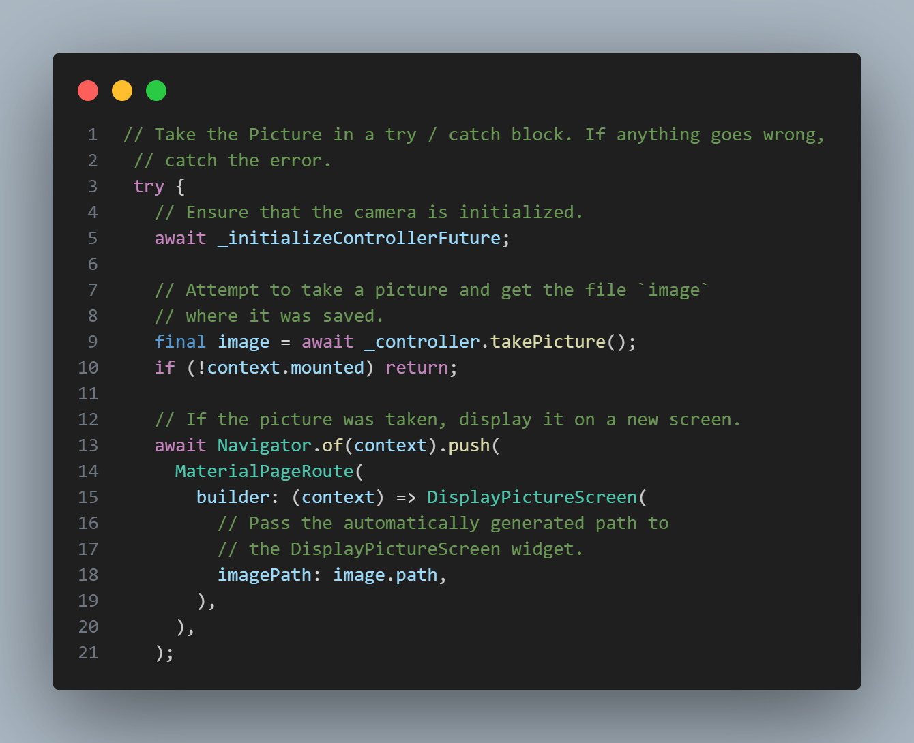

<table>
    <thead>
        <th style="text-align: center;" colspan="2">Pertemuan 7</th>
    </thead>
    <tbody>
        <tr>
            <td>Nama</td>
            <td>Rizky Fitri Andini</td>
        </tr>
        <tr>
            <td>Nim</td>
            <td>2241720170</td>
        </tr>
    </tbody>
</table>

# **Pertemuan 09 | Kamera**

## Praktikum 1 : Mengambil Foto dengan Kamera di Flutter
Selesaikan langkah-langkah praktikum berikut ini menggunakan editor Visual Studio Code (VS Code) atau Android Studio atau code editor lain kesukaan Anda.
### Langkah 1
Buat sebuah project flutter baru dengan nama `kamera_flutter`

### Langkah 2
Jalankan perintah `flutter pub add`

### Langkah 3
Kode ini letakkan dalam `void main()` pada `lib/main`.dart dan ubah `void main()` menjadi async function 

### Langkah 4
Membuat dan menginisialisasi `CameraController`

### Langkah 5
Gunakan widget `CameraPreview` dari package camera untuk menampilkan preview foto. Perlu tipe objek void berupa `FutureBuilder` untuk menangani proses async.

### Langkah 6
Kode berikut letakkan dalam `Widget build` setelah field body pada `lib/widget/takepicture_screen.dart`

### Langkah 7
Buat file baru `displaypicture_screen.dart `pada `lib/widget`

### Langkah 8
Edit pada file ini bagian `runApp` pada `lib/main.dart`

### Langkah 9
Tambahkan kode seperti berikut pada bagian try / catch agar dapat menampilkan hasil foto pada `DisplayPictureScreen`.

Hasil:
Take a picture

Display the picture

## Praktikum 2 : Membuat photo filter carousel
Semua orang tahu bahwa foto akan terlihat lebih bagus dengan filter. Pada codelab ini, Anda akan membuat rangkaian pilihan filter yang dapat digeser sesuai pilihan warna.

Berikut ini menunjukkan aplikasi yang akan Anda buat:

### Langkah 1
Buat project flutter baru dengan nama `photo_filter_carousel`

### Langkah 2
Buatlah folder widget dan file baru dengan nama `filter_selector.dart`

### Langkah 3
Buatlah folder widget dan file baru dengan nama `filter_carousel.dart`

### Langkah 4
Buatlah folder widget dan file baru dengan nama `filter_item.dart`

### Langkah 5
Buatlah folder widget dan file baru dengan nama `carousel_flowdelegate.dart`

### Langkah 6
Tambah kode pada `void main()`

Hasil:

