<table>
    <thead>
        <th style="text-align: center;" colspan="2">Pertemuan 11</th>
    </thead>
    <tbody>
        <tr>
            <td>Nama</td>
            <td>Rizky Fitri Andini</td>
        </tr>
        <tr>
            <td>Nim</td>
            <td>2241720170</td>
        </tr>
    </tbody>
</table>

# Pertemuan #11 | Pemrograman Asynchronous
## Praktikum 1 
Selesaikan langkah-langkah praktikum berikut ini menggunakan editor Visual Studio Code (VS Code) atau Android Studio atau code editor lain kesukaan Anda. Jawablah di laporan praktikum Anda pada setiap soal yang ada di beberapa langkah praktikum ini.
### Langkah 1
Buatlah sebuah project flutter baru dengan nama books di folder src week-11 repository GitHub Anda. 

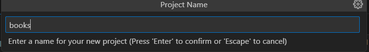

Kemudian Tambahkan dependensi http dengan mengetik perintah berikut di terminal.

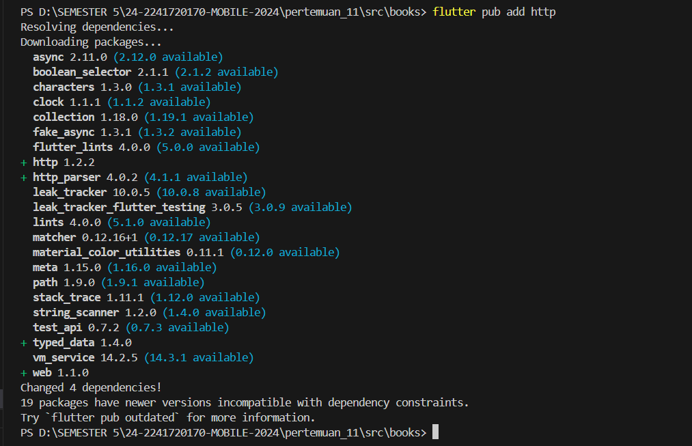

### Langkah 2
Jika berhasil install plugin, pastikan plugin http telah ada di file pubspec ini seperti berikut.

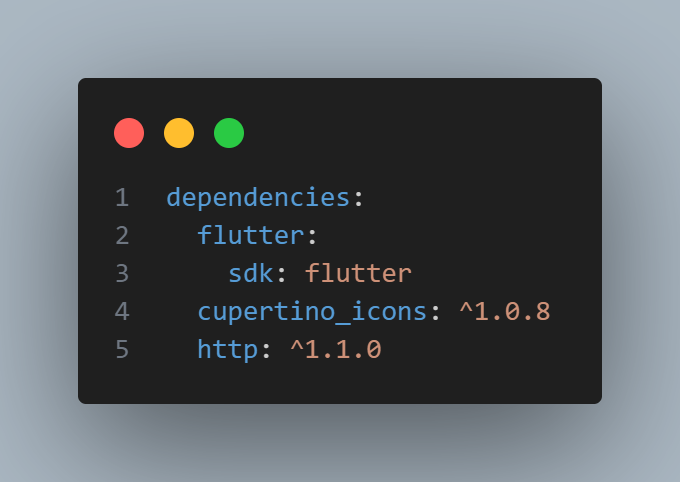

### Langkah 3
Edit main.dart dan tambahkan nama panggilan Anda pada title app sebagai identitas hasil pekerjaan Anda.

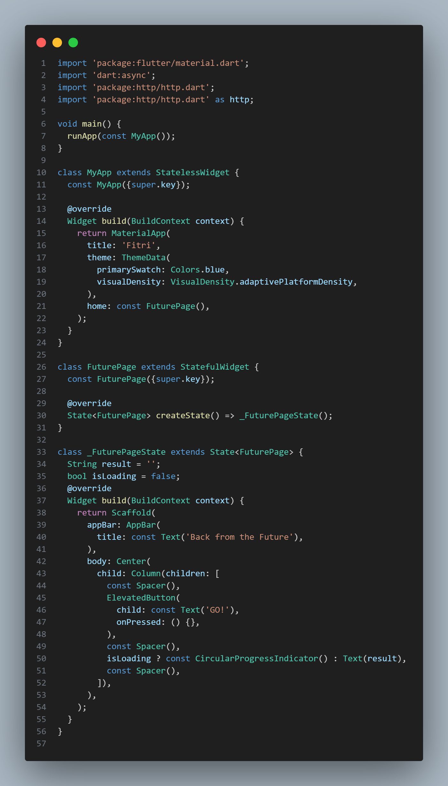

### Langkah 4
Tambahkan method ini ke dalam class _FuturePageState

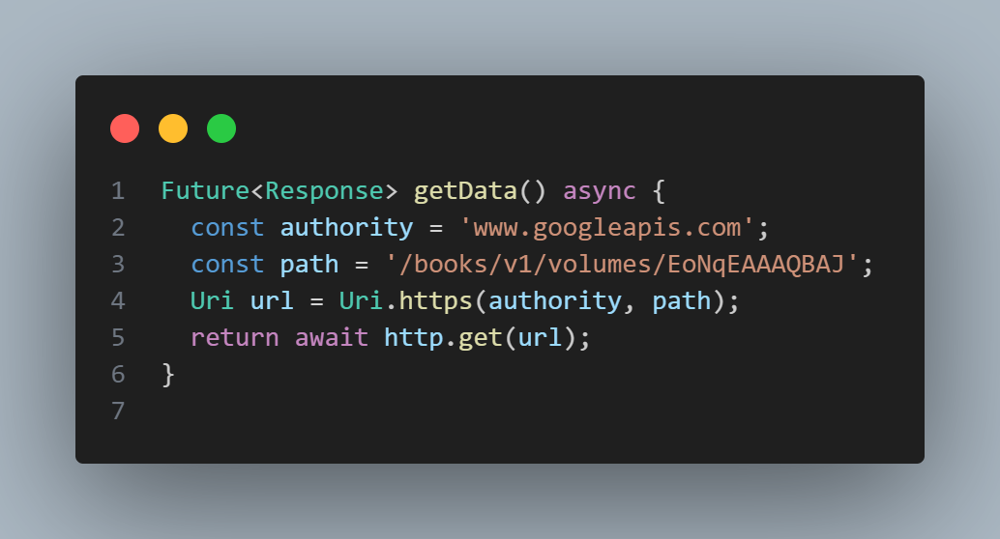

Carilah judul buku favorit Anda di Google Books, lalu ganti ID buku pada variabel path di kode tersebut. Caranya ambil di URL browser Anda seperti gambar berikut ini.

Kemudian cobalah akses di browser URI tersebut dengan lengkap seperti ini. Jika menampilkan data JSON, maka Anda telah berhasil. Lakukan capture milik Anda dan tulis di README pada laporan praktikum. Lalu lakukan commit dengan pesan "W11: Soal 2".

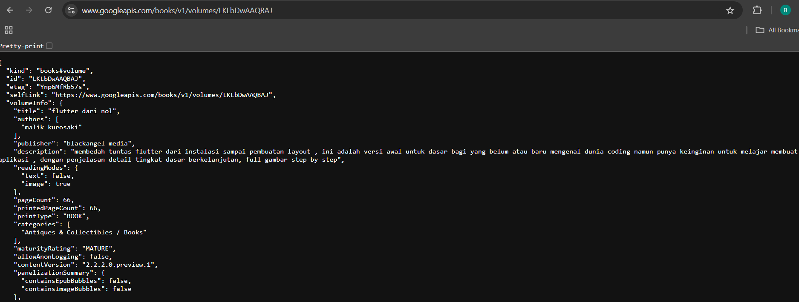

### Langkah 5
Tambahkan kode pada onPressed di ElevatedButton seperti berikut.

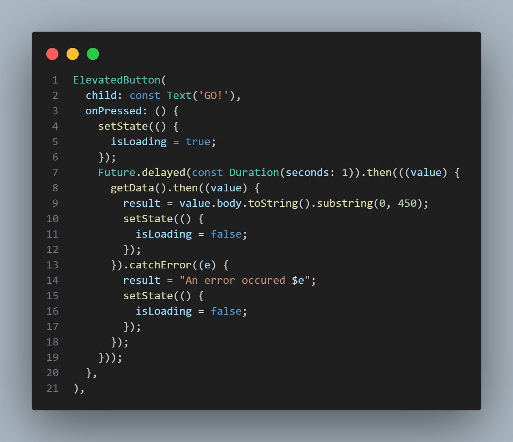

Hasil:

>- substring(0, 450) untuk membatasi hasil respons API (value.body) hingga 450 karakter pertama agar tidak terlalu panjang. Namun, jika panjang respons kurang dari 450 karakter, hal ini bisa menyebabkan error. Untuk menghindarinya, perlu ditambahkan validasi panjang string sebelum memotongnya.
>- blok catchError untuk menangkap kesalahan yang mungkin terjadi saat memanggil fungsi asynchronous getData(). Jika terjadi error, pesan kesalahan akan disimpan ke dalam variabel result, dan status isLoading diubah menjadi false untuk menghentikan indikator pemrosesan.

## Praktikum 2
Setelah Anda menyelesaikan praktikum 1, Anda dapat melanjutkan praktikum 2 ini. Selesaikan langkah-langkah praktikum berikut ini menggunakan editor Visual Studio Code (VS Code) atau Android Studio atau code editor lain kesukaan Anda. Jawablah di laporan praktikum Anda pada setiap soal yang ada di beberapa langkah praktikum ini.
### Langkah 1
Tambahkan tiga method berisi kode seperti berikut di dalam class _FuturePageState.

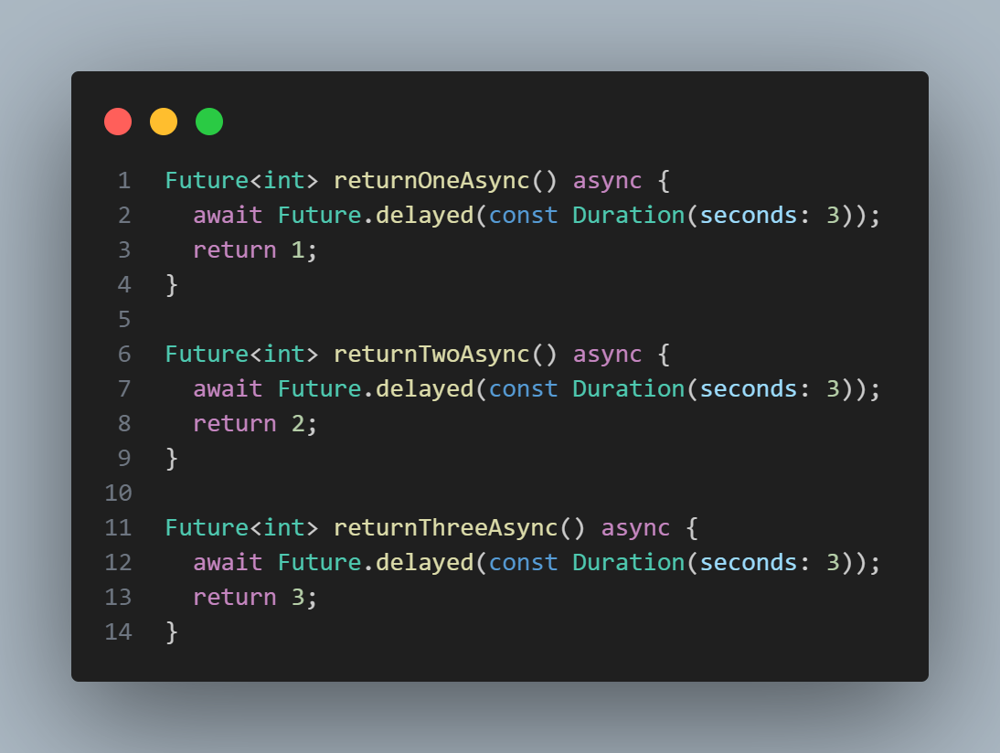
### Langkah 2
Lalu tambahkan lagi method ini di bawah ketiga method sebelumnya.

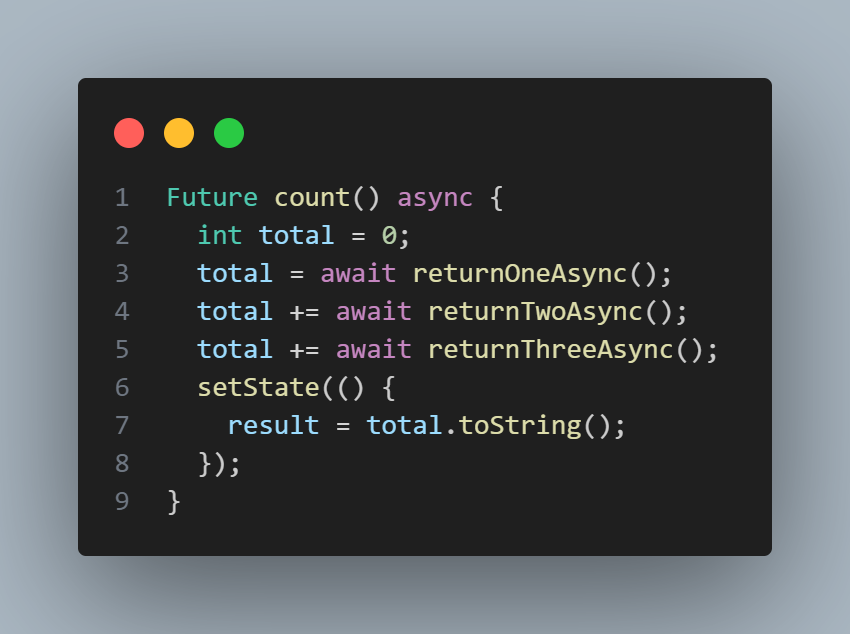
### Langkah 3
Lakukan comment kode sebelumnya, ubah isi kode onPressed()
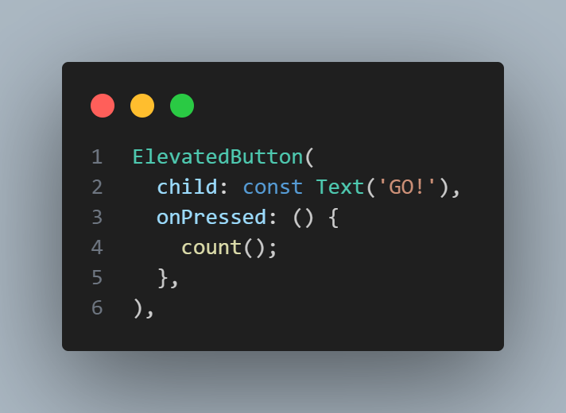

### Langkah 4
Akhirnya, run atau tekan F5 jika aplikasi belum running. Maka Anda akan melihat seperti gambar berikut, hasil angka 6 akan tampil setelah delay 9 detik.

>Kode pada langkah 1 dan 2 menjalankan tiga fungsi asynchronous secara berurutan, masing-masing menunda selama 3 detik sebelum mengembalikan nilai 1, 2, dan 3. Fungsi count() menjumlahkan hasil dari ketiga fungsi ini secara sequential, sehingga total waktu eksekusi adalah 9 detik. Setelah selesai, hasil penjumlahan diperbarui di UI menggunakan setState.
## Praktikum 3
Setelah Anda menyelesaikan praktikum 2, Anda dapat melanjutkan praktikum 3 ini. Selesaikan langkah-langkah praktikum berikut ini menggunakan editor Visual Studio Code (VS Code) atau Android Studio atau code editor lain kesukaan Anda. Jawablah di laporan praktikum Anda pada setiap soal yang ada di beberapa langkah praktikum ini.
### Langkah 1
Pastikan telah impor package async berikut.
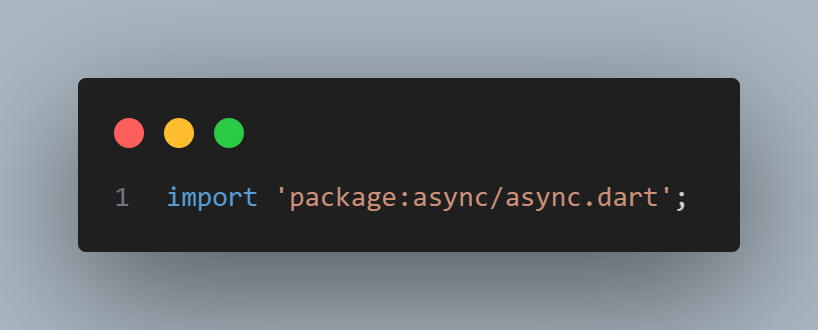
### Langkah 2
Tambahkan variabel late dan method di class _FuturePageState
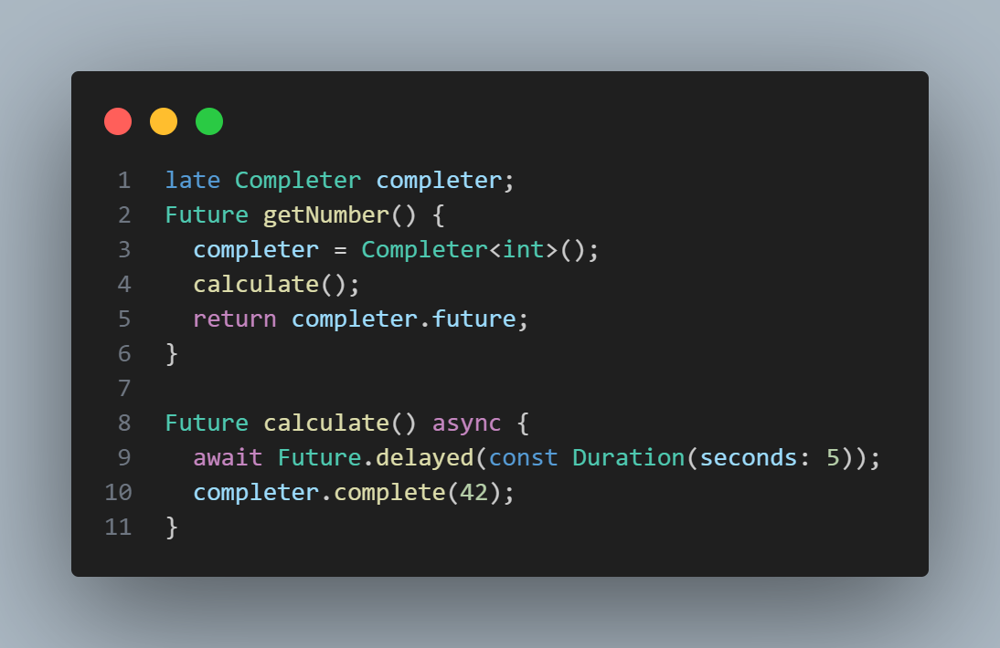

### Langkah 3
Tambahkan kode berikut pada fungsi onPressed()
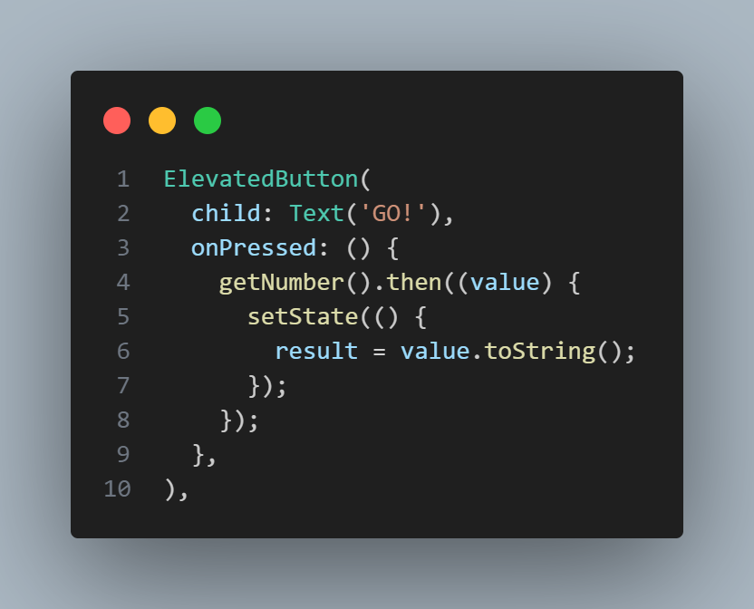

### Langkah 4
Terakhir, run atau tekan F5 untuk melihat hasilnya jika memang belum running. Bisa juga lakukan hot restart jika aplikasi sudah running. Maka hasilnya akan seperti gambar berikut ini. Setelah 5 detik, maka angka 42 akan tampil.

>Kode pada langkah 2 menggunakan `Completer` untuk mengelola `Future` secara manual. Fungsi `getNumber()` mengembalikan `Future` yang akan selesai setelah fungsi `calculate()` menunda eksekusi selama 5 detik, lalu menyelesaikan `Completer` dengan nilai 42 menggunakan `completer.complete(42)`.
### Langkah 5
Gantilah isi code method calculate() seperti kode berikut, atau Anda dapat membuat calculate2()
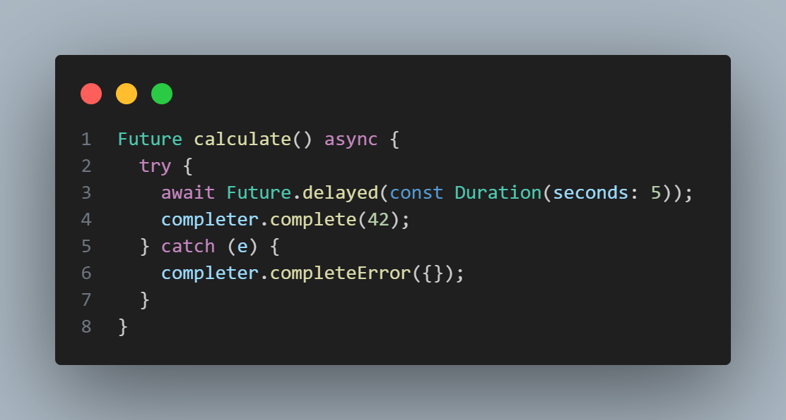
### Langkah 6
Pindah ke onPressed()

Hasil:

>Perbedaan kedua langkah tersebut memberikan perlindungan lebih terhadap kesalahan yang mungkin terjadi selama eksekusi asynchronous, dan dengan menangkap error menggunakan completeError, kita dapat memberikan penanganan yang lebih baik terhadap situasi yang tidak terduga.
## Praktikum 4
Setelah Anda menyelesaikan praktikum 3, Anda dapat melanjutkan praktikum 4 ini. Selesaikan langkah-langkah praktikum berikut ini menggunakan editor Visual Studio Code (VS Code) atau Android Studio atau code editor lain kesukaan Anda. Jawablah di laporan praktikum Anda pada setiap soal yang ada di beberapa langkah praktikum ini.
### Langkah 1
Tambahkan method ini ke dalam class _FuturePageState
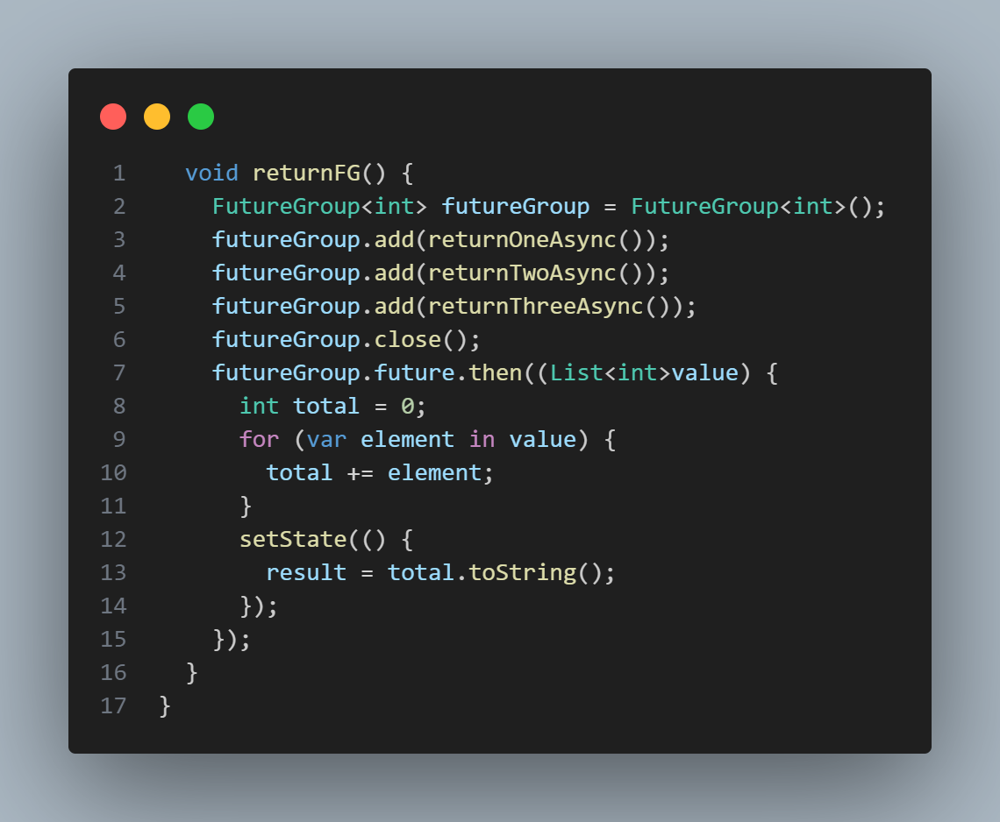

### Langkah 2
Anda bisa hapus atau comment kode sebelumnya, kemudian panggil method dari langkah 1 tersebut.
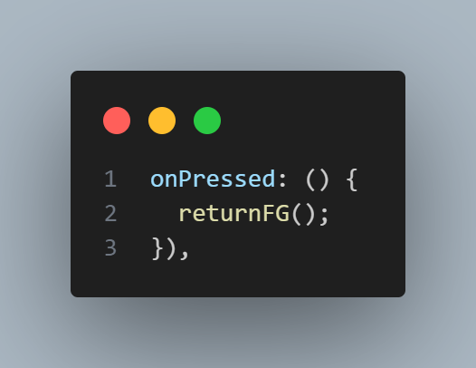

### Langkah 3
Anda akan melihat hasilnya dalam 3 detik berupa angka 6 lebih cepat dibandingkan praktikum sebelumnya menunggu sampai 9 detik.

### Langkah 4
Anda dapat menggunakan FutureGroup dengan Future.wait seperti kode berikut.
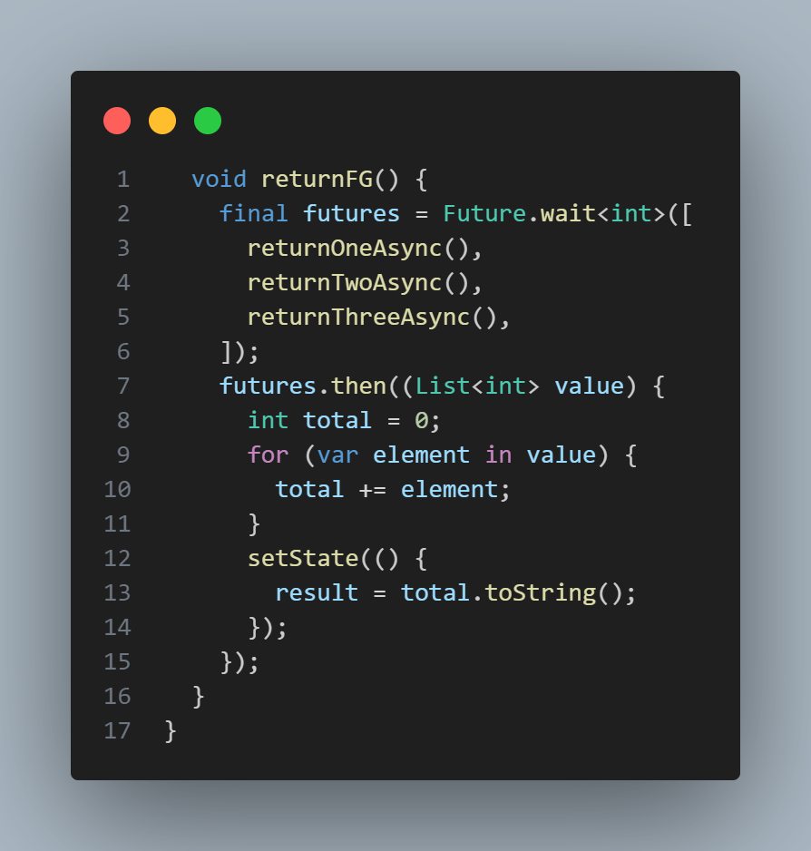
>Perbedaan antara langkah 1 dan langkah 3 terletak pada cara mengelola beberapa future. Pada langkah 1, digunakan FutureGroup untuk menangani beberapa future, di mana setiap future ditambahkan menggunakan metode `add`, dan `close` menandakan bahwa tidak ada future tambahan yang akan ditambahkan. Sebaliknya, langkah 3 memanfaatkan Future.wait untuk menggabungkan beberapa future menjadi satu future tunggal yang menyelesaikan proses setelah semua future selesai dijalankan.
## Praktikum 5
