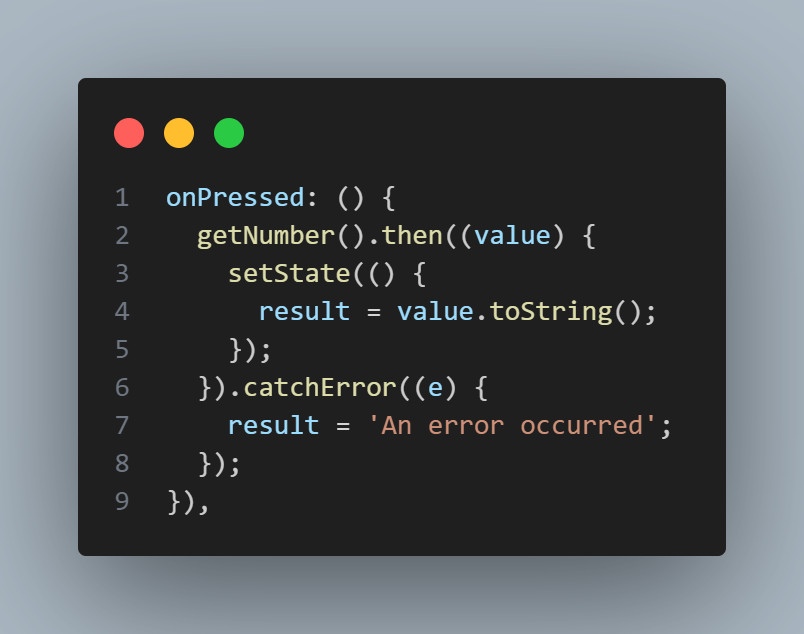
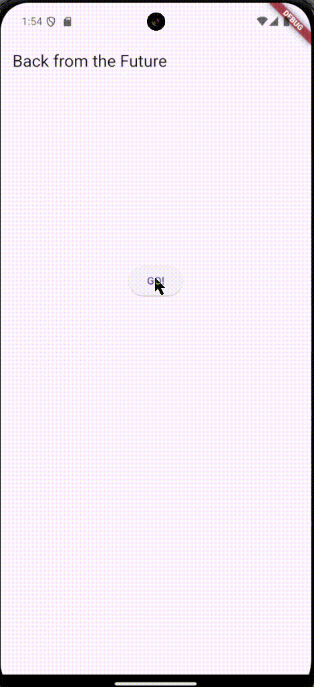

<table>
    <thead>
        <th style="text-align: center;" colspan="2">Pertemuan 11</th>
    </thead>
    <tbody>
        <tr>
            <td>Nama</td>
            <td>Rizky Fitri Andini</td>
        </tr>
        <tr>
            <td>Nim</td>
            <td>2241720170</td>
        </tr>
    </tbody>
</table>

# Pertemuan #11 | Pemrograman Asynchronous
## Praktikum 1 
Selesaikan langkah-langkah praktikum berikut ini menggunakan editor Visual Studio Code (VS Code) atau Android Studio atau code editor lain kesukaan Anda. Jawablah di laporan praktikum Anda pada setiap soal yang ada di beberapa langkah praktikum ini.
### Langkah 1
Buatlah sebuah project flutter baru dengan nama books di folder src week-11 repository GitHub Anda. 

Kemudian Tambahkan dependensi http dengan mengetik perintah berikut di terminal.

### Langkah 2
Jika berhasil install plugin, pastikan plugin http telah ada di file pubspec ini seperti berikut.

### Langkah 3
Edit main.dart dan tambahkan nama panggilan Anda pada title app sebagai identitas hasil pekerjaan Anda.

### Langkah 4
Tambahkan method ini ke dalam class _FuturePageState

Carilah judul buku favorit Anda di Google Books, lalu ganti ID buku pada variabel path di kode tersebut. Caranya ambil di URL browser Anda seperti gambar berikut ini.

Kemudian cobalah akses di browser URI tersebut dengan lengkap seperti ini. Jika menampilkan data JSON, maka Anda telah berhasil. Lakukan capture milik Anda dan tulis di README pada laporan praktikum. Lalu lakukan commit dengan pesan "W11: Soal 2".

### Langkah 5
Tambahkan kode pada onPressed di ElevatedButton seperti berikut.

Hasil:

>- substring(0, 450) untuk membatasi hasil respons API (value.body) hingga 450 karakter pertama agar tidak terlalu panjang. Namun, jika panjang respons kurang dari 450 karakter, hal ini bisa menyebabkan error. Untuk menghindarinya, perlu ditambahkan validasi panjang string sebelum memotongnya.
>- blok catchError untuk menangkap kesalahan yang mungkin terjadi saat memanggil fungsi asynchronous getData(). Jika terjadi error, pesan kesalahan akan disimpan ke dalam variabel result, dan status isLoading diubah menjadi false untuk menghentikan indikator pemrosesan.

## Praktikum 2
Setelah Anda menyelesaikan praktikum 1, Anda dapat melanjutkan praktikum 2 ini. Selesaikan langkah-langkah praktikum berikut ini menggunakan editor Visual Studio Code (VS Code) atau Android Studio atau code editor lain kesukaan Anda. Jawablah di laporan praktikum Anda pada setiap soal yang ada di beberapa langkah praktikum ini.
### Langkah 1
Tambahkan tiga method berisi kode seperti berikut di dalam class _FuturePageState.

### Langkah 2
Lalu tambahkan lagi method ini di bawah ketiga method sebelumnya.

### Langkah 3
Lakukan comment kode sebelumnya, ubah isi kode onPressed()

### Langkah 4
Akhirnya, run atau tekan F5 jika aplikasi belum running. Maka Anda akan melihat seperti gambar berikut, hasil angka 6 akan tampil setelah delay 9 detik.

>Kode pada langkah 1 dan 2 menjalankan tiga fungsi asynchronous secara berurutan, masing-masing menunda selama 3 detik sebelum mengembalikan nilai 1, 2, dan 3. Fungsi count() menjumlahkan hasil dari ketiga fungsi ini secara sequential, sehingga total waktu eksekusi adalah 9 detik. Setelah selesai, hasil penjumlahan diperbarui di UI menggunakan setState.
## Praktikum 3
Setelah Anda menyelesaikan praktikum 2, Anda dapat melanjutkan praktikum 3 ini. Selesaikan langkah-langkah praktikum berikut ini menggunakan editor Visual Studio Code (VS Code) atau Android Studio atau code editor lain kesukaan Anda. Jawablah di laporan praktikum Anda pada setiap soal yang ada di beberapa langkah praktikum ini.
### Langkah 1
Pastikan telah impor package async berikut.

### Langkah 2
Tambahkan variabel late dan method di class _FuturePageState

### Langkah 3
Tambahkan kode berikut pada fungsi onPressed()

### Langkah 4
Terakhir, run atau tekan F5 untuk melihat hasilnya jika memang belum running. Bisa juga lakukan hot restart jika aplikasi sudah running. Maka hasilnya akan seperti gambar berikut ini. Setelah 5 detik, maka angka 42 akan tampil.

>Kode pada langkah 2 menggunakan `Completer` untuk mengelola `Future` secara manual. Fungsi `getNumber()` mengembalikan `Future` yang akan selesai setelah fungsi `calculate()` menunda eksekusi selama 5 detik, lalu menyelesaikan `Completer` dengan nilai 42 menggunakan `completer.complete(42)`.
### Langkah 5
Gantilah isi code method calculate() seperti kode berikut, atau Anda dapat membuat calculate2()

### Langkah 6
Pindah ke onPressed()

Hasil:

>Perbedaan kedua langkah tersebut memberikan perlindungan lebih terhadap kesalahan yang mungkin terjadi selama eksekusi asynchronous, dan dengan menangkap error menggunakan completeError, kita dapat memberikan penanganan yang lebih baik terhadap situasi yang tidak terduga.
## Praktikum 4
Setelah Anda menyelesaikan praktikum 3, Anda dapat melanjutkan praktikum 4 ini. Selesaikan langkah-langkah praktikum berikut ini menggunakan editor Visual Studio Code (VS Code) atau Android Studio atau code editor lain kesukaan Anda. Jawablah di laporan praktikum Anda pada setiap soal yang ada di beberapa langkah praktikum ini.
### Langkah 1
Tambahkan method ini ke dalam class _FuturePageState

### Langkah 2
Anda bisa hapus atau comment kode sebelumnya, kemudian panggil method dari langkah 1 tersebut.

### Langkah 3
Anda akan melihat hasilnya dalam 3 detik berupa angka 6 lebih cepat dibandingkan praktikum sebelumnya menunggu sampai 9 detik.

### Langkah 4
Anda dapat menggunakan FutureGroup dengan Future.wait seperti kode berikut.

>Perbedaan antara langkah 1 dan langkah 3 terletak pada cara mengelola beberapa future. Pada langkah 1, digunakan FutureGroup untuk menangani beberapa future, di mana setiap future ditambahkan menggunakan metode `add`, dan `close` menandakan bahwa tidak ada future tambahan yang akan ditambahkan. Sebaliknya, langkah 3 memanfaatkan Future.wait untuk menggabungkan beberapa future menjadi satu future tunggal yang menyelesaikan proses setelah semua future selesai dijalankan.
## Praktikum 5
Setelah Anda menyelesaikan praktikum 4, Anda dapat melanjutkan praktikum 5 ini. Selesaikan langkah-langkah praktikum berikut ini menggunakan editor Visual Studio Code (VS Code) atau Android Studio atau code editor lain kesukaan Anda. Jawablah di laporan praktikum Anda pada setiap soal yang ada di beberapa langkah praktikum ini.
### Langkah 1
Tambahkan method ini ke dalam class _FuturePageState

### Langkah 2
Ganti dengan kode berikut

### Langkah 3
Run dan klik tombol GO!

### Langkah 4
Tambahkan kode ini di dalam class _FutureStatePage

>`returnError()` mensimulasikan fungsi asinkron yang melempar error setelah jeda 2 detik tanpa menangani error tersebut. Sebaliknya, `handleError()` bertugas menangkap error dari `returnError()` menggunakan blok `try-catch`, menyimpan pesan error ke variabel `result`, dan memastikan tindakan akhir tetap dilakukan melalui blok `finally`. Singkatnya, `returnError()` menghasilkan error, sementara `handleError()` mengelola dan menangani error tersebut.
## Praktikum 6
Setelah Anda menyelesaikan praktikum 5, Anda dapat melanjutkan praktikum 6 ini. Selesaikan langkah-langkah praktikum berikut ini menggunakan editor Visual Studio Code (VS Code) atau Android Studio atau code editor lain kesukaan Anda. Jawablah di laporan praktikum Anda pada setiap soal yang ada di beberapa langkah praktikum ini.
### Langkah 1
Tambahkan plugin geolocator dengan mengetik perintah berikut di terminal.

### Langkah 2
Jika Anda menargetkan untuk platform Android, maka tambahkan baris kode berikut di file android/app/src/main/androidmanifest.xml

### Langkah 3
Tambahkan file baru ini di folder lib project Anda.

### Langkah 4
Buat class LocationScreen di dalam file geolocation.dart
### Langkah 5: Isi kode geolocation.dart

### Langkah 6
Panggil screen baru tersebut di file main Anda seperti berikut.

### Langkah 7
Run project Anda di device atau emulator (bukan browser), maka akan tampil seperti berikut ini.

### Langkah 8
Tambahkan widget loading seperti kode berikut. Lalu hot restart, perhatikan perubahannya.

>Iya, karena mengizinkan permintaan untuk mengakses lokasi.
## Praktikum 7
Setelah Anda menyelesaikan praktikum 6, Anda dapat melanjutkan praktikum 7 ini. Selesaikan langkah-langkah praktikum berikut ini menggunakan editor Visual Studio Code (VS Code) atau Android Studio atau code editor lain kesukaan Anda. Jawablah di laporan praktikum Anda pada setiap soal yang ada di beberapa langkah praktikum ini.
### Langkah 1
Buka file geolocation.dart kemudian ganti isi method dengan kode ini.

### Langkah 2
Tambah variabel ini di class _LocationScreenState

### Langkah 3
Tambah method ini dan set variabel position

### Langkah 4
Ketik kode berikut dan sesuaikan. Kode lama bisa Anda comment atau hapus.

>Ya, ada perbedaan dalam UI dibandingkan dengan pendekatan sebelumnya yang mungkin menggunakan pemanggilan manual terhadap future dan setState untuk mengelola perubahan UI. FutureBuilder memberikan pengalaman yang lebih reaktif, terstruktur, dan efisien untuk mengintegrasikan data asinkron ke dalam UI.

### Langkah 5
Tambahkan kode berikut untuk menangani ketika terjadi error. Kemudian hot restart.

>Tidak ada perubahan pada UI karena tampilannya tetap sama. Perbedaan utama terletak pada cara penanganan error. Namun, dalam program ini, tidak ada error yang terjadi sehingga kode langsung mengeksekusi perintah `return` tanpa melewati blok penanganan error.

## Praktikum 8
Setelah Anda menyelesaikan praktikum 7, Anda dapat melanjutkan praktikum 8 ini. Selesaikan langkah-langkah praktikum berikut ini menggunakan editor Visual Studio Code (VS Code) atau Android Studio atau code editor lain kesukaan Anda. Jawablah di laporan praktikum Anda pada setiap soal yang ada di beberapa langkah praktikum ini.
### Langkah 1
Buatlah file baru navigation_first.dart di project lib Anda.

### Langkah 2
Isi kode navigation_first.dart

### Langkah 3
Buatlah file baru navigation_second.dart di project lib Anda.

### Langkah 4
Edit main.dart

### Langkah 5
Lakukan Run
>Ketika tombol ditekan, `Navigator.pop` mengembalikan nilai warna yang telah dipilih ke halaman pertama, yang kemudian memperbarui tampilannya agar sesuai dengan warna baru tersebut.

## Praktikum 9
Setelah Anda menyelesaikan praktikum 8, Anda dapat melanjutkan praktikum 9 ini. Selesaikan langkah-langkah praktikum berikut ini menggunakan editor Visual Studio Code (VS Code) atau Android Studio atau code editor lain kesukaan Anda. Jawablah di laporan praktikum Anda pada setiap soal yang ada di beberapa langkah praktikum ini.
### Langkah 1
Buat file baru navigation_dialog.dart

### Langkah 2
Isi kode navigation_dialog.dart

### Langkah 3
Edit main.dart

### Langkah 4
Lakukan Run
>Ketika tombol "Change Color" ditekan, sebuah pop-up muncul untuk memilih warna yang diinginkan. Misalnya, jika pengguna memilih warna merah, latar belakang akan berubah menjadi merah. Hal ini terjadi karena `Navigator.pop` mengembalikan nilai warna yang dipilih ke halaman pertama, sehingga tampilan halaman tersebut diperbarui untuk mencerminkan warna baru.

