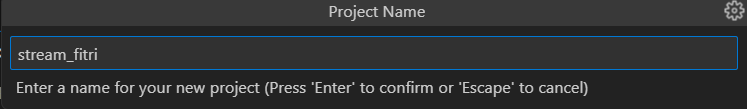
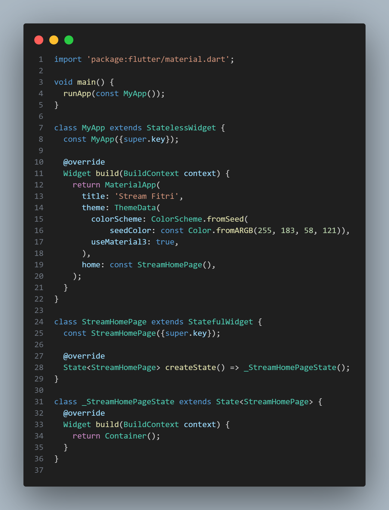

<table>
    <thead>
        <th style="text-align: center;" colspan="2">Pertemuan 12</th>
    </thead>
    <tbody>
        <tr>
            <td>Nama</td>
            <td>Rizky Fitri Andini</td>
        </tr>
        <tr>
            <td>Nim</td>
            <td>2241720170</td>
        </tr>
    </tbody>
</table>

# Pertemuan 12 | Lanjutan State Management dengan Streams
Pada codelab ini, Anda akan mempelajari tentang streams dan BLoC di Flutter beserta contoh penggunaannya. Cara kerja, manfaat, dan cara mengelola state lebih lanjut.
## Praktikum 1: Dart Streams
Selesaikan langkah-langkah praktikum berikut ini menggunakan editor Visual Studio Code (VS Code) atau Android Studio atau code editor lain kesukaan Anda. Jawablah di laporan praktikum Anda (ketik di README.md) pada setiap soal yang ada di beberapa langkah praktikum ini.
### Langkah 1: Buat Project Baru

### Langkah 2: Buka file main.dart

